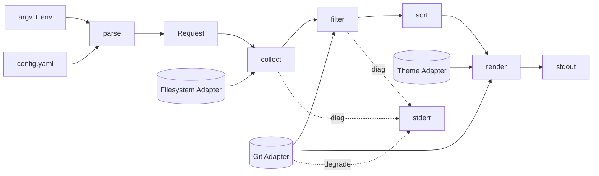
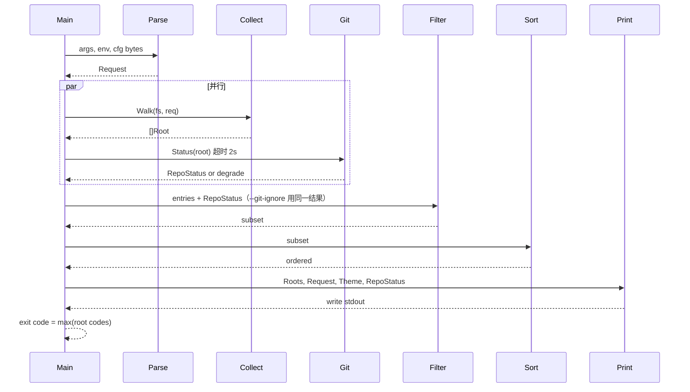
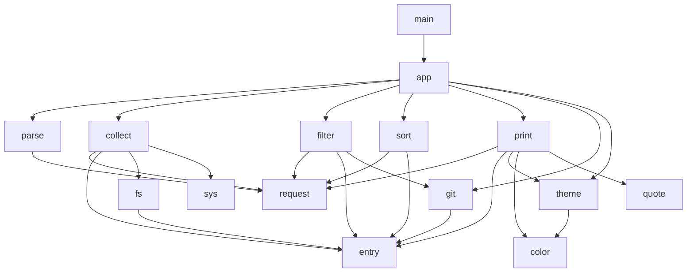

# g 从零重写架构方案

| 字段 | 值 |
| --- | --- |
| 文档标题 | g rewrite: 只做 TTY listing 的跨平台 ls |
| 作者 | TBD |
| 日期 | 2026-08-14 |
| 状态 | Draft（探索版，分支 `rewrite/v1`；不进生产渠道） |
| 目标版本 | 1.0.0 设计目标（不兼容 0.31.2）；**不**在本阶段发 brew/scoop/默认安装 |
| Module | `github.com/Equationzhao/g` |
| License | MIT（保留现有 LICENSE） |
| 语言 | Go 1.26+ |
| Flag 预算 | **40 个主选项**（32 正交维度 + 8 个纯 GNU 短选项别名入口） |

## Overview

当前 `g`（v0.31.2）已经不再是一个深模块：`internal/cli` 用 urfave `Action` 往包级切片和全局 Printer 上堆副作用，`main.preprocessArgs` 把 YAML 配置拼进 `os.Args`，测试靠 `gomonkey` 补丁 `os.Exit` / `os.ReadFile`。已注册 flag **123** 个（`internal/cli/*.go` 里 124 个 `Name:` token，其中一个是 App 的 `Name: "g"`），另有 `--git-ignore`、`--extended` 写在 man page 里却未注册。本方案从零重写：目录列出是唯一职责；CLI 与配置填同一个不可变 `Request`；数据流固定为 `parse → request → collect → filter → sort → render`；Filesystem / Git / Theme / Printer 做成各有两个 Adapter 的真缝。不兼容旧 g 的超长 alias、环境变量副作用、os.Args 注入、fuzzy/leveldb、查重、checksum、mime 探测。

---

## 1. 现状诊断

### 1.1 仓库事实

| 项 | 证据 |
| --- | --- |
| Module / Go | `go.mod`：`module github.com/Equationzhao/g`，`go 1.26.1` |
| 版本 | `internal/cli/version.go`：`Version = "0.31.2"` |
| License | 根目录 `LICENSE`：MIT，Copyright (c) 2023 Equationzhao |
| 入口 | `main.go`（`//go:build !doc`）调用 `preprocessArgs()` 后 `cli.G.Run(os.Args)`；`main_doc.go`（`//go:build doc`）只生成 man |
| CLI 框架 | `github.com/urfave/cli/v2 v2.27.7`，App 挂在包级 `cli.G` |
| 配置 | `internal/config/load.go`：读 `os.UserConfigDir()/g/g.yaml`，字段 `Args []string`，加载后插入 `os.Args[1:]` |
| 规格文档 | `docs/man.md` 与 `internal/cli/g.go` 的 `optionsHelp` 手写两份，已漂移 |
| CI | `.github/workflows/go.yml` 在 macos/ubuntu 上 `go test -v ./...`，**没有 `-race`**；windows job 只 `go build` 不跑测试；`lint.yml` 用 golangci-lint v2.11.3；`gofumpt.yml` 跑 `gofumpt -l -extra` |
| 集成测试 | `docs/TestWorkflow.md` 标明 **Deprecated**；依赖 git submodule `tests/`（Windows 非法文件名会失败） |

### 1.2 包结构（当前）

```
main.go
internal/
  cli/        # flag 定义 + 1000+ 行 logic() 上帝函数
  config/     # YAML → argv
  content/    # 一列一个 Enabler，Enable() 闭包改全局
  display/    # 10+ Printer，包级 Output / IncludeHyperlink / CustomTermSize
  filter/     # 包级函数变量 RemoveHidden 等
  git/        # exec git；包级 ignored / TopLevelCache
  global/     # 颜色常量 + 列名
  index/      # leveldb fuzzy（build tag fuzzy）
  item/       # FileInfo + haxmap Meta
  osbased/    # 平台 inode/time/owner；darwin CGO 解析 Finder alias
  render/     # 读 theme.DefaultAll
  theme/      # 包级 DefaultAll / ColorLevel；init 改全局
  sorter/     # 比较函数笛卡尔积
  util/       # processors + adaptive strategy + termlink
  cached/     # 自研并发 map
  align/      # 包级 set 记录左对齐列
  shell/      # embed 的 --init 脚本
```

`logic`（`internal/cli/g.go:438`）在一个函数里做：icon/git/quote/path 变换、`os.Chdir`、fuzzy、`-R` 动态 `slices.Insert` path、列宽扫描、header hook、exit code。这不是深模块，是过程脚本。

### 1.3 结构腐烂（有代码证据）

#### 腐烂 1：包级可变状态

`internal/cli/g.go:35-66`：

```go
var (
    itemFilterFunc = make([]*filter.ItemFilterFunc, 0)
    contentFunc    = make([]contents.ContentOption, 0)
    noOutputFunc   = make([]contents.NoOutputOption, 0)
    r              = render.NewRenderer(&theme.DefaultAll)
    p              = display.NewFitTerminal()
    timeFormat     = "Jan 02 15:04"
    ReturnCode     = 0
    contentFilter  = contents.NewContentFilter()
    sort           = sorter.NewSorter()
    timeType       = []string{"mod"}
    sizeUint       = contents.Auto
    sizeEnabler    = contents.NewSizeEnabler()
    // ... gitEnabler, nameToDisplay, depthLimitMap, hookPost, allPart
)
```

`internal/theme/color.go:15`：`var ColorLevel = colortool.TermColorLevel()`。  
`internal/theme/default.go:1761`：`var DefaultAll All`，`init()` 写入。  
`internal/display/printer.go:29,232,268`：`var Output io.Writer = os.Stdout`、`var IncludeHyperlink = false`、`var CustomTermSize uint`。  
`internal/git/ignoredcache.go:11-16`：包级 `ignored`、`TopLevelCache` + `sync.Once`。  
`internal/align/left.go:10`：包级 `left` set。  
`internal/config/load.go:39-43,83`：包级 `Dir`、`Default`。

两次 `g` 调用若共享进程（测试里就是）会串状态。`ReturnCode` 是进程级出口。

#### 腐烂 2：flag Action 改全局

几乎每个 flag 的 `Action` 都 `append` 到 `itemFilterFunc` / `contentFunc`，或替换包级 `p`。例：

- `-l`（`internal/cli/view.go:717`）往 `contentFunc` 追加 mode/size/owner/group/time，并把 `p` 换成 `Byline`。
- `--color`（`display.go:44`）直接写 `theme.ColorLevel`。
- `--json`（`display.go:175`）换 Printer、关 header、`theme.SetClassic()`、`theme.ColorLevel = theme.None`。
- `--sort-by-mime-descend` 等四个 bool（`sort.go:181-230`）是排序键 × 方向的笛卡尔积。

这违反「一个维度一个入口」。结果是 `--lh`（名义 human-readable）实际启用整份 long listing（`view.go:349-361`）。

#### 腐烂 3：配置拼接 argv / 修改 os.Args

`main.go:50-80`：

```go
func preprocessArgs() {
    rearrangeArgs()
    if !slices.ContainsFunc(os.Args, hasNoConfig) {
        defaultArgs, err := config.Load()
        if err == nil && !slices.ContainsFunc(defaultArgs.Args, hasNoConfig) {
            os.Args = slices.Insert(os.Args, 1, defaultArgs.Args...)
        }
    } else {
        os.Args = slices.DeleteFunc(os.Args, hasNoConfig)
    }
}
```

`internal/config/load.go:107-119` 还会给没写 `-` 的项自动加 `-`/`--`。配置不是数据，是「再打一遍 CLI」。测试 `Test_preprocessArgs` 必须 patch `config.Load` 并断言 `os.Args` 被改写。

`rearrangeArgs` 自行把 flags 和 paths 拆开重排，因为 urfave 与「路径夹在 flag 中间」不对付。这是在补偿框架，不是产品需求。

#### 腐烂 4：测试用 gomonkey

`go.mod` 直接依赖 `github.com/agiledragon/gomonkey/v2 v2.11.0`。

| 文件 | 补丁对象 |
| --- | --- |
| `main_test.go` | `os.Exit`、`config.Load`；并直接写 `os.Args` |
| `internal/config/load_test.go` | `gomonkey.NewPatches()` |
| `internal/theme/theme_test.go` | `os.ReadFile` |
| `internal/content/name_test.go` | `os.Open`；注释写着 `// TODO gomonkey seems not working ?` |

`justfile:298` 用 `go test -gcflags=all=-l` 关掉内联才能让补丁生效。这是测试面长在运行时补丁上，而不是长在 Interface 上。

#### 腐烂 5：文档与实现不一致

- `docs/man.md:87` 与 `g.go:255` 写了 `--git-ignore`。`logic` 读 `context.Bool("git-ignore")`（`g.go:536`）。**没有任何 `cli.Flag` 注册该名字。** 该功能对用户是死的。
- `g.go:312` 帮助文本写了 `--extended, -@`。**未注册。**
- `docs/man.md` 版本仍写 `0.30.0`；代码是 `0.31.2`。
- `--zero` 文档说「每行以 NUL 结束」。`display.Zero.Print`（`printer.go:465`）只是拼接 `OrderedContent`，**不写 `\x00`**。

#### 腐烂 6：进程工作目录是隐藏状态

`logic` 在非 `-A` 时 `os.Chdir(path[i])` 再读 `.` / `..`（`g.go:779`），多路径之间再 `os.Chdir(startDir)`（`g.go:963`）。并发 fuzzy 更新、相对路径、测试隔离全部被破坏。这不是 listing，是在改进程环境。

#### 腐烂 7：Windows 不是一等公民

- Hidden 判定只看 `strings.HasPrefix(name, ".")`（`filter/itemfliter.go:148`），忽略 `FILE_ATTRIBUTE_HIDDEN`。
- Inode 在 Windows 返回 `"-"`（`osbased/filedetail_windows.go:15`），但 `-i` 仍可打开。
- CI windows job 不跑测试。
- `docs/TestWorkflow.md` 明确：测试数据含 Windows 非法文件名。
- darwin 为 Finder alias 开了 CGO（`filedetail_darwin.go` + `macos_alias.h`），`justfile` 对 darwin `CGO_ENABLED=1`。跨平台构建不对称。

#### 腐烂 8：自适应策略是假深度

`util/adaptive_strategy.go` 先 `ReadDir` 估大小，再决定 Traditional vs Batch，而 Batch 内部还是 `ReadDir`。`hasComplexFilters`（`cli/helpers.go:29`）**恒返回 `false`**。多出来的 Interface 没有换掉任何东西——删掉它复杂度不会回到调用方，因为它本来就是一层转发。

#### 腐烂 9：上帝 `FileInfo`

`item.FileInfo` 嵌 `os.FileInfo`，再挂 `*cached.Map[string, Item]` 和 `map[string][]byte`。列内容以字符串塞进 map，Printer 再按 key 扫描对齐。类型系统不知道有哪些列。`content.ContentFilter.GetDisplayItems` 对每个 entry 开 goroutine（`contentfilter.go:92`），10×CPU 信号量，只为调用一组纯函数。这是为并发而并发。

### 1.4 当前 flag / 子命令 / 配置 / build tag 盘点

**子命令**：无。全部是全局 flag。`--init`、`--rebuild-index`、`--list-index` 等用 `Err4Exit` 冒充子命令（`index.go` 的 Action 返回 `Err4Exit{}`，`main.go` 吞掉且不印错误）。

**配置键**（`config.Config`）：

| 键 | 现状 |
| --- | --- |
| `Args` | 字符串数组，注入 argv |
| `CustomTreeStyle` | `{Child, LastChild, Mid, Empty}` |
| `Theme` | theme JSON 路径 |

**环境变量**：`TIME_TYPE`、`SI`、`TIME_STYLE`（urfave `EnvVars`）；`OLDPWD`（路径为 `-` 时）；hyperlink 探测用 `FORCE_HYPERLINK` / `VTE_VERSION` / `TERM_PROGRAM` 等。`LS_COLORS` 未读。`NO_COLOR`：g 自己没有处理器；`theme.ColorLevel = colortool.TermColorLevel()` 把色深探测委托给 gookit（该库文档声称尊重 `NO_COLOR`）。重写后改为 §4.4 的显式规则，不再经过 gookit。

**Build tag**：

| tag | 文件 | 作用 |
| --- | --- | --- |
| `fuzzy` / `!fuzzy` | `internal/index/pathindex.go` / `pathindex_lite.go` | leveldb 索引；无 tag 时 `--fuzzy` 静默忽略 |
| `mounts` / `!mounts` | `content/mounts.go` / `mounts_lite.go` | gopsutil 挂载信息 |
| `theme` | `theme/defaultini.go` | 生成 default.json |
| `custom` | `theme/custom_builtin.go` | 编译期烤进 custom theme |
| `debug` / `!debug` | `global/debug/*` | panic 是否打印 |
| `doc` / `!doc` | `main.go` / `main_doc.go` | 生成 man |
| `linux`/`darwin`/`windows`/`unix` | `osbased/*`、`theme/sys_*` | 平台 |
| `(arm\|\|386) && linux` 等 | `osbased/time_linux_*.go` | 32/64 位 timespec |
| `linux \|\| darwin` | `internal/cached/cachedmaps.go` | unix 专用并发 map |
| 按文件名 | `osbased/flags_{linux,darwin,windows}.go`、`newline_{unix,windows}.go` | 平台 flags / 换行；无额外 tag 名 |

静默忽略未编译进去的 flag（`docs/BuildOption.md:52-60`）会让用户以为功能开了。重写后：**不再用可选 feature tag 藏功能**；砍掉的功能从 CLI 消失。平台文件只保留 `GOOS`/`GOARCH` 差异。

### 1.5 对照 GNU ls、eza、lsd

核对来源（2026-08-14）：

- GNU ls：`https://manpages.ubuntu.com/manpages/noble/man1/ls.1.html`、`https://www.mankier.com/1/ls`（man7.org / gnu.org 在本环境被 SSRF 拦截，改用 Ubuntu / ManKier 镜像）
- eza：官方 man `https://github.com/eza-community/eza/blob/main/man/eza.1.md` 与 README
- lsd：官方 man `https://github.com/lsd-rs/lsd/blob/main/doc/lsd.md`、README、`doc/samples/config-sample.yaml`

#### 学什么

| 来源 | 学 |
| --- | --- |
| GNU ls | 退出码 0/1/2；stdout=listing、stderr=诊断；`-l -a -A -h -1 -R -t -S -r -d -F` 语义；`--color=always\|auto\|never`；`--hyperlink` 同三态；`-Q`/`-N` 引用；`--` 结束选项；组合短选项 `-lah`；`-h` 是 human-readable 不是 help |
| GNU ls | `--color=auto` 仅当 stdout 是 TTY；`NO_COLOR` 存在则视为 never，除非 CLI 显式 `always`（eza man 写明「手动设置覆盖 NO_COLOR」） |
| eza | `--git` 两字符列（staged/unstaged），git 失败不阻塞 listing；`--git-ignore`；`--sort=FIELD` 单一入口；`--icons=WHEN` 三态；tree + long 可组合；XDG 下的 theme 文件 |
| eza | `--color` / `--icons` / `--hyperlink` 都是 `always\|auto\|never`，不把色深塞进同一个 flag；`-F/--classify=WHEN` 同样三态 |
| eza | theme 语义组 `image/video/music/...`；owner 三分 Self/Root/Other；size 按单位分色 |
| lsd | 配置是**结构化 YAML**（`color.when`、`icons.when`、`sorting.column`），不是 argv 切片；XDG：`$XDG_CONFIG_HOME/lsd` 或 `~/.config/lsd`；Windows `%APPDATA%\lsd`；`--config-file` + `--ignore-config` 收成 `--config=PATH\|none` |
| lsd | layout 只有 grid/tree/oneline 三种，不搞 markdown/csv 矩阵 |
| lsd | `icon-theme: fancy\|unicode` 做成 theme/config 键（不加 flag）；symlink 箭头进 theme；`--group-dirs=first\|last\|none` |
| 两者 | 默认 TTY 网格；`-l` 是列集合不是另一种「程序」；git 是可选列 |

#### 故意不学什么

| 来源 | 不学 | 理由 |
| --- | --- | --- |
| GNU ls | `--quoting-style` 的 8 种风格、`--indicator-style`、`--tabsize`、`--block-size` 全部 SI 前缀、SELinux `-Z`、`--author` | 超出 listing 肌肉记忆；引用只留 default / `-Q` / `-N` |
| GNU ls | `LS_COLORS` 解析 | theme JSON 是唯一自定义颜色入口；解析 LS_COLORS 是另一个产品 |
| eza | `--code`/`--loc`（cloc）、`--color-scale`、`--mounts`、`--extended`/`-@`、`--context`/`-Z`、`--git-repos`、`--smart-group`、`--total-size`、`--stdin`、Nix hash 缩短 | 不是 ls；能交给 `tokei`/`du`/`stat`。体积分色用 theme `size` 键，不加 `--color-scale` |
| eza | `EZA_STRICT` / `EZA_ICONS_AUTO` / `LS_COLORS` 双源 | 严格性是默认（非法组合 exit 2），不藏进环境变量 |
| eza | `-h` 表示 header | 与 GNU `-h` 冲突；产品不变量要求 GNU `-h` |
| eza | `-a` 按次数叠加（一次≈`-A`，两次含 `.` `..`） | 跟 GNU 不一致；我们严格 GNU：`-a` 含 `.` `..`，`-A` 不含 |
| lsd | `blocks:` 任意列排列、`icons.yaml`+`colors.yaml`+`config.yaml` 三文件、`--icon-theme` flag、`--context`、`--truncate-owner` | 一列一个配置项会回到笛卡尔积；theme 一个 JSON 文件；图标集不是 CLI 维度 |
| lsd | `--hyperlink` 默认 `never` | 我们默认 `auto`（TTY 且终端声明支持时开） |
| 旧 g | table / markdown / csv / tsv / party / duplicate / checksum / mime / charset / fuzzy / streamlit / `--init` | 见 §3 cut 理由 |
| 旧 g | `--format` 同时接受 `l` 和 `C`（把 long 当 layout） | long 是列集合，与 grid/tree 正交；学 eza：`-l -T` 合法 |

---

## 2. 产品边界与非目标

### 2.1 产品不变量（不可破）

1. **唯一职责**：列出用户给出的路径。不是文件管理器，不是 find/du/fd/zoxide。
2. **跨平台一等公民**：linux / darwin / windows。同一套 Interface，平台差异关在 `internal/sys` 与 `internal/fs` 的 Adapter 里。默认 `CGO_ENABLED=0`。Windows 的 quoting、SID、reparse、git `NUL`、补全见 §4.10。
3. **TTY**：图标、颜色、theme。非 TTY 默认无色无图标。
4. **git status 可选列**：失败降级（**每个**格子填 `--`，两字符；只要请求了 `--git` 就保留该列，不省略），不阻塞 listing，不因此把退出码升到 2。
5. **三种主视图**：默认多列网格、`-l` long、`-T` tree。三者按规则可组合（见 §4）。
6. **GNU/POSIX 短选项肌肉记忆**：`-l -a -A -h -1 -R -t -S -r -d -F` 语义对齐 GNU ls。
7. **I/O 契约**：stdout = listing；stderr = 诊断；退出码 0 / 1 / 2 对齐 GNU ls。
8. **语言与身份**：Go；module path `github.com/Equationzhao/g`；MIT license。

### 2.2 非目标（默认砍，1.0 不做）

- 持久化 fuzzy / zoxide 索引（leveldb）
- 文件查重、checksum、charset 探测、mount 详情
- streamlit、`web/` 落地页进主程序
- TUI / 交互式文件管理
- 为旧 g 的超长 alias、环境变量副作用、`os.Args` 注入做兼容
- `--init` 向 stdout 打 shell 函数（completion 继续以仓库文件分发）
- SELinux/SMACK context、xattr 列、macOS Finder alias CGO 解析
- 递归目录总大小（那是 `du`）
- 读 stdin 路径列表（那是 `xargs`）
- LS_COLORS 解析
- 可选 build tag 裁功能

### 2.3 Unix 哲学（本项目操作定义）

- 只做 listing；能交给别的程序的事不要做。
- flag 正交可组合；一个维度一个入口。
- 禁止一列一个 bool（`--perm` `--size` `--owner` `--group` `--time` 这类）。
- 禁止排序键笛卡尔积 flag（`--sort-by-mime-descend` 这类）。
- 核心 flag 预算 **40**。
- 配置和 CLI 解析进同一个 `Request`。禁止修改 `os.Args`。
- 依赖默认走标准库；第三方必须能写清它换掉了哪一块、为什么值得。

---

## 3. Flag / 配置 / theme 的 keep-merge-cut 表

计数口径：当前 **123** 个已注册 flag（`internal/cli/*.go` 含 124 个 `Name:` token，其中一个是 App `Name: "g"`）+ 2 个只存在于文档的名字。重写后 **40** 个主选项。

### 3.1 KEEP（语义保留，名字以新列为准）

| 当前 | 新 | 理由 |
| --- | --- | --- |
| `-l/--long` | `-l/--long` | 不变量 |
| `-a/--show-hidden` | `-a/--all` | GNU 名；显示隐藏（含 `.` `..`） |
| `-A/--almost-all` | `-A/--almost-all` | GNU |
| `--lh/--human-readable` | `-h/--human-readable` | 不变量要求 `-h` 是 human-readable |
| `-1/--byline/--oneline` | `-1`（`--format=oneline`） | GNU |
| `-R/--recurse` | `-R/--recursive` | GNU 长名 |
| `-t` | `-t`（`--sort=time` 降序 newest first） | GNU |
| `-S/--sort-by-size` | `-S`（`--sort=size` 降序） | GNU |
| `-r/--reverse` | `-r/--reverse` | GNU |
| `-d/--directory` | `-d/--directory` | GNU |
| `-F/--classify` | `-F/--classify=WHEN` | GNU `-F` ≡ `always`；默认 `never`；`auto` 仅 TTY |
| `-C/--vertical` | `-C`（`--format=grid`） | GNU |
| `-x/--across` | `-x`（`--format=across`） | GNU / eza |
| `-m/--comma` | `-m`（`--format=comma`） | GNU |
| `-T/--tree` | `-T`（`--format=tree`） | eza/lsd |
| `-i/--inode` | `-i/--inode` | 常见 long 附加列；Windows 显示 `-` |
| `-H/--link` | `-H/--links` | GNU `-H` 在 GNU 是 `--dereference`；**我们跟 eza/旧 g：硬链接数**。GNU dereference 改用 `-L` |
| `-n`（现为 limit） | `-n/--numeric-uid-gid` | 归还 GNU 语义 |
| `-G/--no-group` | `-G/--no-group` | GNU |
| `-Q/--quote-name` | `-Q/--quote-name` | GNU |
| `-N/--literal` | `-N/--literal` | GNU |
| `-U/--no-sort` | `-U`（`--sort=none`） | GNU |
| `-X/--sort-by-ext` | `-X`（`--sort=ext`） | GNU |
| `-B/--ignore-backups` | `-B/--ignore-backups` | GNU |
| `-I/--ignore` | `-I/--ignore` | GNU/eza |
| `-D/--only-dir` | `-D/--only-dirs` | eza |
| `-0/--zero` | `-0/--zero` | 修成真正写 NUL |
| `--color` | `--color` | 只保留 WHEN，去掉 LEVEL 混用 |
| `--theme` | `--theme` | 不变量 |
| `--git/--git-status` | `--git` | 不变量 |
| `--hyperlink` | `--hyperlink` | eza/GNU |
| `--no-config` | `--config=none` | 与 `--config=PATH` 同一入口（lsd `--ignore-config` + `--config-file`） |
| `--no-dereference` | `--no-dereference` | 默认行为的显式名 |
| `--dereference` | `-L/--dereference` | GNU `-L` |
| `--time-style` | `--time-style` | GNU/eza |
| `--si` | `--si` | GNU |
| `--header` | `--header` | eza/lsd（注意 eza `-h` 是 header，我们不学） |
| `--depth` | `--depth` | tree/recurse 上限 |
| `--dir-first/--group-directories-first` | `--dir-order=first\|last\|none` | 单一入口；`--dir-first` 是 `first` 的别名 |
| `--sort` | `--sort` | 单一排序维度 |
| `--block/--blocks` | `--blocks` | allocated blocks 列 |
| `--term-width` | `--width` | eza `-w`；测试需要可复现列宽 |
| `--no-icon/--icon` | `--icons=WHEN` | 合并成三态 |
| `--help/-?` | `--help/-?` | **不再占用 `-h`** |
| `--version/-v` | `--version` | **不再占用 `-v`**（`-v` 给 version-sort） |

文档中的 `--git-ignore`：**真正实现并注册**（KEEP 意图，FIX 实现）。

### 3.2 MERGE（多个入口收成一个维度）

| 当前一簇 | 新入口 | 规则 |
| --- | --- | --- |
| `--format` + `-C -1 -x -m -T -j --tb --md --CSV --TSV` + `--byline` | `--format=grid\|across\|oneline\|comma\|tree\|json` | 短选项只是 setter；table/md/csv/tsv 删除 |
| `--color` 的 `always\|auto\|never\|basic\|256\|24bit` + `--colorless` + `--classic` | `--color=always\|auto\|never` | 色深自动探测；classic = color=never 且 icons=never，由配置/组合表达 |
| `--icon` + `--no-icon` | `--icons=always\|auto\|never` | `never` 覆盖；默认 `auto` |
| `--no-config` + （新）指定文件 | `--config=PATH\|none` | `--no-config` ≡ `--config=none`；lsd `--config-file` ≡ `--config=PATH` |
| `--dir-first` + eza `--group-directories-last` | `--dir-order=first\|last\|none` | 与 Visibility 一样是枚举；默认 `none` |
| `--sort` 的 40+ 字段 + `--sort-by-mime*` × 4 + `--width`（排序）+ `--versionsort` | `--sort=name\|size\|time\|ext\|version\|none` + `-t -S -X -U -v` | 禁止大小写敏感变体、禁止 mime 排序、禁止 name-width 排序 |
| `--time-type` + `--access` + `--modify` + `--create` + `--birth` + `--time` | `--time=modified\|accessed\|changed\|birth` | 一次只显示一种时间。`created` 是 `changed` 的别名（ctime），不是 birth |
| `--time-style` + `--full-time` + `--rt/--relative-time` | `--time-style=default\|iso\|long-iso\|full-iso\|relative\|+FORMAT` | `--full-time` ≡ `--time-style=full-iso` |
| `--uid` + `--gid` + `--numeric` | `-n/--numeric-uid-gid` | 一次开关 |
| `-g` + `-o` + `--all/--la` + `--owner` + `--group` + `--perm` + `--size` + `--time` + `--no-owner`/`-O` | `-l` 固定列集 + `-G` + `-g`/`-o` 作为 long 变体 | 见 §4.3；禁止一列一个 bool |
| `--fp/--full-path` + `--relative-to` | 砍 relative-to；绝对路径用 `--format` 不提供。需要绝对名时用户 `g -1` 后自行 `realpath` | 见 cut |
| `size-unit/block-size` 的 bit/b/k/m/g/t/auto | `-h` + `--si` | 单位不是独立产品维度 |
| `--tree-style` ascii/unicode/rectangle + `CustomTreeStyle` | locale 决定：UTF-8 → unicode 线，否则 ASCII | 零 flag |

### 3.3 CUT（每个都有理由）

| 当前 | 理由 |
| --- | --- |
| `--duplicate/--dup` 及查重实现 | 那是 `fdupes`；读全文件哈希，O(bytes) |
| `--fuzzy/-f`、`--rebuild-index`、`--list-index`、`--remove-index`、`--remove-current-path`、`--remove-invalid-path`、`--disable-index` | 持久化索引 / zoxide；非目标 |
| `--checksum`、`--checksum-algorithm` | 那是 `sha256sum` |
| `--charset` | 那是 `file(1)` / chardet |
| `--mime`、`--mime-parent`、`--only-mime` | 那是 `file --mime`；还拖进 `mimetype` 依赖并 `SetLimit(1<<20)` |
| `--mounts` | 那是 `findmnt`；gopsutil |
| `--ext`、`--no-ext`、`-M/--match`、`--no-dir`/`--file` | glob 过滤只留 `-I`；正面匹配交给 `find`/`fd`；`--no-dir` 并入 `--only-files` |
| `--before`、`--after` | 时间过滤是 find |
| `--show-only-hidden/--hidden` | 与 `-a` 正交但极少用；`g -a` + 外部 grep |
| `-n/--limit`（旧语义） | 截断 listing 不是 ls；把 `-n` 还给 GNU numeric |
| `--stdin` | `xargs -d '\n' g` |
| `--init` | completion 以文件分发；主程序不打印脚本 |
| `--bug` | README / GitHub issue 模板 |
| `--party/--disco` | 玩具 |
| `--statistic`、`--footer`、`--#` | 统计与行号不是 listing |
| `--total-size`、`--no-total-size`、`--recursive-size` | 那是 `du` |
| `--git-detail`、`--git-repo-branch`、`--git-repo-status` | 仓库仪表盘，不是 per-file 列 |
| `--tb/--table`、`--md/--markdown`、`--CSV`、`--TSV`、`--table-style` | 结构化机器格式只留 json；表格是 go-pretty 的全部存在理由。`-0` 是 oneline 的记录分隔符，不是第三种格式（KD6、KD24） |
| `--classic` | 由 `--color=never --icons=never` 组合 |
| `--colorless/--no-color` | `--color=never` |
| `--ft/--file-type` | `-F` 的减 `*` 变体；一种能力一种做法 |
| `--octal-perm` | rwx 足够；需要八进制用 `stat` |
| `--smart-group` | 默默藏 group 会让脚本脆弱 |
| `--flags`（macOS UF_*） | 平台小品；`chflags`/`ls -O` |
| `--birth` 独立 bool | 并入 `--time=birth` |
| `--owner` `--group` `--perm` `--size` `--time` 独立 bool | 一列一个 bool，禁止 |
| `-O/--no-owner` | 用 `-g`（GNU：long 且不印 owner） |
| `--all/--la`（旧：同时 -l 且 -a） | 组合由用户写 `-la`，禁止第三种「all」 |
| `--lh` 旧行为（误开 long） | 拆开 |
| `--no-path-transform/--np` 及 `.../` → `../../` | 默认不做魔术路径。`~` / `~/...` 经 `UserHomeDir` 展开；名为 `~` 的文件必须写成 `./~`（进程看不到 shell 引号） |
| `--relative-to`、`--fp/--full-path` | 路径变换不是 ls；json 里给 `path` 绝对路径即可 |
| `--width` 作为**排序**键 | 按显示宽度排序无 POSIX 对应 |
| `--sort-by-mime*` × 4 | mime 已砍 |
| `Name` / `.name` 大小写敏感排序变体 | `--sort=name` 一律大小写不敏感（windows 友好）；需要字节序用 `LC_ALL=C` 未来再议，1.0 不做 |
| `--extended/-@`（文档幽灵） | xattr 不是 listing 主路径 |
| `SI`/`TIME_TYPE`/`TIME_STYLE` 环境变量副作用 | 只认 `NO_COLOR`、`TIME_STYLE`（GNU 同名，且仅当 CLI 未写 `--time-style`）、`COLUMNS` |
| `--si` 的 EnvVars 自动开 | 必须显式 flag 或配置字段 |

### 3.4 配置 keep-merge-cut

| 当前 | 处置 |
| --- | --- |
| `Args: []string` | **CUT**。配置禁止变 argv |
| `Theme: path` | KEEP，改名为 `theme`（小写，见 §5） |
| `CustomTreeStyle` | CUT。tree 线由 locale 决定 |
| （新）结构化字段 | 与 `Request` 同形，见 §5 |

### 3.5 Theme keep-merge-cut

| 当前 | 处置 |
| --- | --- |
| `internal/theme/default.json` 结构：`info/permission/size/git/owner/group/symlink/name/special/ext` | KEEP 形状，**加** `classes` / `icon_set` / `symlink.arrow`；删掉 `charset`/`checksum`/`mime` 键 |
| 编译期 `-tags=custom` / `-tags=theme` | CUT。theme 只运行时加载 |
| `theme/sys_{linux,darwin,windows}.go` 在 `init` 里改 `DefaultAll` | MERGE 进 builtin theme 的 `name` 表，按 GOOS 选一份常量，不改全局 |
| 包级 `DefaultAll`、`ColorLevel` | CUT。Theme 是值，经构造函数注入 |
| 巨型 `ext` 表各写一色 | MERGE 进 `classes`（image/video/…），ext 只做映射 |
| 单套 Nerd Font 图标 | MERGE：builtin 带 `nerd` + `unicode` 两套；键选，不加 flag |

---

## 4. CLI 规格（主接口）

### 4.1 argv 语法

```
g [OPTION]... [PATH]...
```

1. 选项与路径可交错；**解析器收集全部 token，不重排、不写 `os.Args`**。
2. `--` 之后全部是路径（包括以 `-` 开头的文件名）。
3. 短选项可组合：`-lah` ≡ `-l -a -h`。需要值的短选项（仅 `-I`）必须是组合里的最后一个：`-lI'*.o'` 或 `-I '*.o'`。
4. 长选项：`--name`、`--name=value`、`--name value`（对取值选项）。
5. 布尔长选项不接受 `=false` 之外的否定；关闭用对立选项（`--color=never`，不是 `--no-color`）。
6. 未知选项：stderr 一行诊断 + 可选「Did you mean `--foo`?」，退出码 **2**。
7. 零路径 ⇒ 隐式 `.`。
8. 路径 `-` **不是 stdin**，就是名为 `-` 的文件；需要 stdin 用 `xargs`。旧 g 把 `-` 映射到 `$OLDPWD`：**删除**。
9. 路径 token 等于 `~` 或前缀为 `~/` 时，用 `os.UserHomeDir` 展开。`~other` 原样保留。名为 `~` 的文件必须写成 `./~`（argv 里没有引号信息，`g ~` 与 `g '~'` 相同）。不做 `.../` → `../../`。
10. 不读 `os.Args` 以外的「注入参数」。测试传入 `[]string`。
11. 可重复的取值选项（仅 `-I`）：每次出现 **追加**，不替换。
12. `-0` 在它出现的位置写入一组隐含 setter（见 §4.2）。之后的 flag 仍 last-wins；**最终态**再走 §4.1.3 的纯净校验（后写 `--color=always` 会 exit 2，不是合法覆盖）。

### 4.1.1 四种消解（全部交互只能落在其中一格）

| 类 | 含义 | 例子 |
| --- | --- | --- |
| **same-dim** | 同一维度，后者替换前者，**不是冲突** | `-a`/`-A`；`-D`/`--only-files`；`-Q`/`-N`；`--format` 的 setter；`--sort`/`-t`/`-S`/`-X`/`-U`/`-v`；`--time`；`--config`；`--dir-order`；所有 `When` |
| **error** | 最终态无法同时成立 → **exit 2**，不 listing | json+`-0`；json+`--hyperlink=always`；`Zero && Format≠oneline`；未知枚举；`--width=0`；负 `--depth`；§4.1.3 的 `-0` 污染项 |
| **suppresses** | 有明确赢家，另一方被忽略或改写，exit 0 | `-l` 压制 grid/across/comma（强制 oneline）；`-T` 压制 `-R`；`--si` 压制 `-h`；`-d` 压制 `-R`/`-T` 的递归与 `--depth`（§4.1.2）；`-r` 不打破 `--dir-order` 的组顺序 |
| **ignored** | 组合无意义但不报错 | `--blocks`/`--header` 无 `-l`；`-H` 有 `-l` 时不加第二列；json 下 `hyperlink=auto` / `classify=auto\|always` 视为 off |
| **orthogonal** | 彼此独立，都生效 | 未列出的维度对；`-U`+`-r` 是正交（§4.1.4） |

YAML 例外（比 CLI 严）：`only_dirs`+`only_files` 同文件 → exit 2（map 无顺序）。`all`+`almost_all` → `almost_all`。

### 4.1.2 `-d` 压制表

`-d` 在 §4.1 的合法/非法表里原先缺席。规则：**`-d` 压制 Walk，不 exit 2**（对齐 GNU：列出参数自身，递归无从谈起）。

| 与 `-d` 同用 | 最终行为 |
| --- | --- |
| `-R` | 当没写 `-R`。每个 argv 根只列出自己 |
| `-T` / `--format=tree` | 每个根仍按 tree 画，但是**只有该节点、无子女、无树边**（等价单行名字；`-l -d -T` 仍是 long 一行） |
| `--depth=N` | 忽略。已经没有可裁的子树 |
| `-R --depth=0` **不**写 `-d` | 仍按 §4.2 树表：对该根等价 `-d`（只列根）。这是 `--depth` 的语义，不是 `-d` 的压制 |

`DirSelf=true` 时 `collect` 不 `ReadDir`。

### 4.1.3 `-0` 流纯净规则

`-0` 的存在意义是 **xargs -0 / 含换行文件名的 round-trip**。token 位置的 setter 仍然写入 `Format=oneline`、`Color/Icons/Hyperlink/Classify=never`、`Quote=literal`、`Zero=true`，之后 last-wins。但 **Validate 在最终态上再加一道闸**——后写回来的污染项不能靠 last-wins 放行。

**最终态若 `Zero`，下列任一成立 → exit 2：**

| 最终态 | 污染 |
| --- | --- |
| `Format != oneline`（含 json/tree/grid/across/comma） | 已有规则 |
| `Color==always` 或 `Icons==always` | ANSI / 多字节图标混进记录 |
| `Hyperlink==always` | OSC 8 混进记录 |
| `Classify==always` | `*` `/` `@` 混进路径 |
| `Quote==always`（`-Q`） | 引号成为路径的一部分，`xargs -0` 拿到假路径 |

因此：

| argv | 结果 |
| --- | --- |
| `-0` | 合法 |
| `--color=always -0` | 合法（setter 把 color 打回 never） |
| `-0 --color=always` | **exit 2**（不再是合法 last-wins） |
| `-0 -Q` / `-Q -0` | `-Q -0` 合法（setter 打回 literal）；`-0 -Q` **exit 2** |
| `-0 --format=json` | **exit 2** |
| `--format=json -0` | 合法（setter 改成 oneline） |

**`Zero` 时名字渲染 = 原始字节，不是 `-N`。** `-N` 把 `\n`/`\r`/CSI 换成 `?`，会毁掉含换行文件名的 round-trip。`Zero` 覆盖 Quote：不包引号、不把 `\n` 变成 `?`；记录之间只靠 `\0`。名字里若含 `\0`（几乎不会从 `ReadDir` 来），该字节显示为 `?`，其余原样。json 不受 `-0` 影响（两者互斥）。

**压制 / 忽略（不报错）：**

| 组合 | 规则 |
| --- | --- |
| `-0` + `--header` | 忽略 header（表头不是文件名） |
| `-0` + 多根 / `-R` | **不印** `path:` 目录头，也不印根间空行。每个条目一条记录：`{name}\0`。递归变成扁平名字流 |
| `-0` + `-l` | 合法。整行 long 文本 + `\0`（学 GNU `--zero`）。long 行里的**名字字段**仍是原始字节 |
| `-0` + `-T` | `Format=tree` → 已由 `Zero && Format≠oneline` exit 2 |
| `-0` + `Classify/Hyperlink/Color=auto` | Resolve 后为 never，合法 |

配置 `zero: true` 套完 setter 之后，同一文件里的 `color: always` / `quote: always` 视为最终态，走上面的 exit 2（YAML 无 token 顺序，不能靠「先 zero 后 color」逃逸）。

### 4.1.4 其余补上的交互

**`-U`（`--sort=none`）+ `-r`：正交。** `-r` 反转 `ReadDir` 的原始顺序（组内；`--dir-order` 的组顺序仍不变）。不忽略 `-r`（GNU `-Ur` 忽略 `-r`；我们选正交，因为 `-r` 是独立维度，且 `-U` 不在产品不变量短选项里）。golden：`ReadDir` 得 `[a,b,c]` 则 `-Ur` 打印 `c b a`。

**命令行根参数豁免过滤。** `-D` / `--only-files` / `-I` / `-B` / `--git-ignore` / 默认隐藏规则，**只作用于目录的子女**，不作用于用户写在 argv 里的根。`g -D file.txt dir/`：列出 `file.txt`（根豁免）以及 `dir/` 里的目录子女。`g .hidden` 即使无 `-a` 也列出该根。根不存在仍 exit 2；根存在但被「过滤条件讨厌」不改变退出码。学 eza：只过滤 listing 内容。

**`-g` + `-o`：隐含 `-l`，owner 与 group 都不印**（GNU）。与 `-g -G` 相同终态。§4.2 只写过 `-o`+`-G`，这里补上。

**`-F` 后缀叠放：** 分类符是名字的**最后一段裸字符**，在引号外、在 OSC 8 的 visible text 外。

```
默认 quoting + -F 目录:  'my dir'/
-Q + -F:                "my dir"/
hyperlink + -F:         OSC8{file://...}{visible=quoted name}OSC8 /
-0 + -F=always:         exit 2（§4.1.3）
```

宽度计算：后缀计入格子宽度。json：无后缀（类型在 `type` 字段）。

非法组合（退出码 2，不 listing）——汇总：

| 组合 | 原因 |
| --- | --- |
| 最终 `--format=json` 且 `-0` | §4.1.3 |
| 最终 `--format=json` 且 `--hyperlink=always` | json 用字段，不用 OSC 8。`auto` 在 json 下视为 off，不报错 |
| 最终 `Zero` 且 `Color/Icons/Hyperlink/Classify==always` 或 `Quote==always` | §4.1.3 |
| 最终 `Zero && Format≠oneline` | 已含 tree/grid/json+Zero |
| `--sort` 未知键、`--color` 未知 WHEN、`--format` 未知值、`--time` 未知值 | 用法错误。`created` 合法，等同 `changed` |
| `-I` 非法 glob | 用法错误 |
| `--config=` 空、`--config` 缺少值、`--dir-order`/`--classify` 未知值 | 用法错误 |
| `--config=PATH` 且该路径不存在或不可读 | 用户显式点名的文件必须在 |
| `--width=0`、负 `--depth` | 用法错误 |

合法组合（明确允许）：

- `-l` + `-T`：tree 的每个节点带 long 列。
- `-l` + `-C`/`-x`/`-m`：`-l` 强制 oneline（GNU：long 即单列）。后出现的 `--format=grid` 若与 `-l` 一起：仍 oneline。**long 赢 layout 的横向格式。**
- `-l` + `--json`：json 对象带 long 字段。
- `-R` + `-T`：`-T` 赢（tree 已递归）；`--depth` 对两者生效（若无 `-d`）。
- `-d` + `-R`/`-T`/`--depth`：§4.1.2，`-d` 赢。
- `-a` 与 `-A`：同一个 `Visibility` 枚举，后者覆盖前者。
- `-D` 与 `--only-files`：同一个 `KindFilter` 枚举，后者覆盖前者。
- `-Q` 与 `-N`：last-wins。
- `-g` 与 `-o`：都不印 owner/group。
- `-U` 与 `-r`：反转 ReadDir 顺序。
- `--icons=never` 覆盖配置里的 `always`。

### 4.2 40 个主选项

「主选项」= 出现在 man SYNOPSIS / OPTIONS 里、计入预算的名字。括号内是别名，**不另计预算**。

默认值写的是「无配置文件、无相关环境变量」时的值。

#### Meta（3）

| Flag | 默认 | 语义 |
| --- | --- | --- |
| `--help`（`-?`） | off | 用法打到 **stdout**，退出 0。占用 `-h` 是旧错。 |
| `--version` | off | `g 1.0.0\n` 到 stdout，退出 0。不含 Go 版本诗。 |
| `--config=SRC` | 未设置：按 §5.1 搜索 | 配置来源，**一个维度**。`SRC` 为文件路径，或字面量 `none`。`--config=none` ≡ `--no-config`（别名，不占预算）：不读任何配置文件，环境变量仍生效。`--config=PATH` ≡ lsd `--config-file`：只读这一份，不搜索 XDG。路径相对进程 cwd；不存在或不可读 → 退出 2。`--config=` 空串非法（退出 2）。后者覆盖前者（`g --config=a.yaml --config=none` 不读文件）。 |

#### Layout（1 维度 + 6 个短选项 setter）

| Flag | 默认 | 语义 |
| --- | --- | --- |
| `--format=FMT` | 未设置：TTY → `grid`，否则 `oneline`（见 §4.2.2） | `grid` `-C`：纵向填列。`across` `-x`：横向填行。`oneline` `-1`：一条一行。`comma` `-m`：逗号+空格，按宽度折行。`tree` `-T`：递归树。`json` `--json`：单一 JSON 文档。配置里写了 `format:` 即视为已设置，管道中也尊重。 |
| `-l` `--long` | off | 打开 long 列集（见 §4.3）。不改变「是否递归」。与 `grid/across/comma` 同用时输出变为 oneline。 |

#### Visibility / walk（5）

| Flag | 默认 | 语义 |
| --- | --- | --- |
| `-a` `--all` | `Visibility=hidden`（默认藏隐藏项） | 设 `Visibility=all`：显示隐藏项，**包括** `.` 与 `..`。与 `-A` 互斥，写入同一枚举。隐藏定义见 §4.6。 |
| `-A` `--almost-all` | 同上 | 设 `Visibility=almost_all`：显示隐藏项，**不包括** `.` 与 `..`。 |
| `-d` `--directory` | off | 目录参数列出自身，不读内容。文件参数仍列出该文件。 |
| `-R` `--recursive` | off | 深度优先列出子目录。每个目录前打印 `path:`。**允许多个根路径**（修复旧 g 的单目录限制）。 |
| `--depth=N` | 无限（`HasDepth=false`） | 打印 `Entry.Depth <= N` 的节点。起点路径 Depth=0，其直接子女=1，再下一层=2。`N=0` 只打印起点自身。负数非法（退出 2）。见下方树表。 |

默认（无 `-a`/`-A`）隐藏「隐藏项」，也不打印 `.` `..`。这与 GNU 默认一致，与旧 g「无 `-A` 时强行插入 `.` `..`」**不同**——旧行为是 bug（还为此 `chdir`）。

`--depth` 示例。磁盘树：

```
a/
  b/
    c
  d
```

对 `g -T a`（无 `--depth` = 无限）：

```
a
├── b
│   └── c
└── d
```

| 命令 | 打印的节点（Depth） |
| --- | --- |
| `g -T --depth=0 a` | `a`（0） |
| `g -T --depth=1 a` | `a`（0），`b`（1），`d`（1） |
| `g -T --depth=2 a` | `a`（0），`b`（1），`c`（2），`d`（1） |
| `g -R --depth=0 a` | 只把 `a` 当一项列出（等价对该根使用 `-d`） |
| `g -R --depth=1 a` | 列出 `a` 的直接子女，不进入 `b/` |

#### Filter（5）

| Flag | 默认 | 语义 |
| --- | --- | --- |
| `-I` `--ignore=GLOB` | 空 | 可重复。匹配 **基名**（不是整路径）。匹配则去掉。语法：`gobwas/glob`（`*` `?` `**` `[a-z]`）。 |
| `-D` `--only-dirs` | `KindFilter=all` | 设 `KindFilter=dirs`：只保留**子女**中的目录（未 `-L` 时 symlink 自身不是 dir，去掉；`-L` 后按目标）。与 `--only-files` 同一枚举。argv 根豁免，见 §4.1.4。 |
| `--only-files` | 同上 | 设 `KindFilter=files`：只保留子女中的非目录。 |
| `-B` `--ignore-backups` | off | 去掉子女中基名以 `~` 结尾的项。argv 根豁免。 |
| `--git-ignore` | off | 去掉子女中被仓库 ignore 的项。与 `--git` 共用同一次 `Git.Status`（§4.2 Git、§6.1）。无 git / 非仓库 / 超时 / 命令失败：不过滤，stderr 一条 warning，退出码仍 0（除非另有错误）。argv 根豁免。 |

#### Sort（3 + 5 个别名）

| Flag | 默认 | 语义 |
| --- | --- | --- |
| `--sort=KEY` | `name` | 见下表。`-t`/`-S`/`-X`/`-U`/`-v` 是同一入口的别名，**不是第二种方向**。 |
| `-r` `--reverse` | off | 反转**组内**主键结果。`--sort=none`（`-U`）时主键就是 `ReadDir` 顺序，`-r` 将其反转（不忽略）。`--dir-order` 的组顺序不受 `-r` 影响（`first` 时目录组仍在前，`last` 时仍在后；GNU `--group-directories-first` + `-r` 同此）。 |
| `--dir-order=POS` | `none` | `first`：目录组在前。`last`：目录组在后。`none`：不分组。未 `-L` 时 symlink 的 `IsDir==false`，不当目录；`-L` 后按目标。`--dir-first` / `--group-directories-first` ≡ `--dir-order=first`（别名，不占预算）。 |

主键与默认方向（GNU `ls --sort=` 对齐）：

| KEY | 别名 | 默认方向（无 `-r`） | 比较 |
| --- | --- | --- | --- |
| `name` | （无） | A→Z | `strings.ToLower` 后 UTF-8 字典序；非法 UTF-8 按字节 |
| `size` | `-S` | **大→小** | `st_size` 数值 |
| `time` | `-t` | **新→旧** | `--time` 所选时间戳 |
| `ext` | `-X` | A→Z | 扩展名（无点）再 name |
| `version` | `-v` | A→Z | GNU coreutils `filevercmp`，见 §4.2.3 |
| `none` | `-U` | `ReadDir` 顺序 | `--dir-order` 仍可分组 |

#### Size / long 附加列（8）

| Flag | 默认 | 语义 |
| --- | --- | --- |
| `-h` `--human-readable` | off | 人类可读、**1024** 进制，后缀 `B K M G T P`（1K=1024）。无 `-h` 且无 `--si` 时 long 的 size 为字节整数。 |
| `--si` | off | 人类可读、**1000** 进制，后缀 `k M G T P`（GNU `--si`：likewise `-h` but powers of 1000）。单独 `--si` 就出 `1k 234M`，不需要同时写 `-h`。配置 `si: true` 同样单独生效。`-h` 与 `--si` 都开时 **SI 赢**（1000），与出现顺序无关。 |
| `-i` `--inode` | off | inode 列。linux/darwin：`stat.Ino`。windows：`-`。**所有布局**都可加此前缀（见 §4.3.1）。 |
| `-H` `--links` | off | 硬链接数。windows：`GetFileInformationByHandle`。**所有布局**都可加此前缀；`-l` 时 nlink 本就在列集里，`-H` 被接受且不再加第二列。 |
| `-n` `--numeric-uid-gid` | off | owner/group 打印数字（windows 打印 SID 字符串，见 §4.10）。 |
| `-G` `--no-group` | off | long 中不印 group。 |
| `--blocks` | off | 512 字节块数（unix `st_blocks`；windows `-`）。**仅 `-l` / tree+long**。 |
| `--header` | off | 仅当存在具名列时印表头：`-l` 与 `-T -l`。grid/across/comma/json 忽略。 |

#### Time（2）

| Flag | 默认 | 语义 |
| --- | --- | --- |
| `--time=WHICH` | `modified` | `modified` / `accessed` / `changed` / `birth`。`created` 是 `changed` 的别名。`changed` = unix `st_ctime`（元数据变更）；windows 无 ctime，用 `LastWriteTime`（与 `modified` 相同）。`birth` = darwin `st_birthtimespec`、windows `CreationTime`、linux `statx(STATX_BTIME)`（内核 4.11+，文件系统支持时）。某文件 `HasBirth==false` 时该格打印 `-`，**不**在 parse 阶段 exit 2。 |
| `--time-style=STYLE` | `default` | `default`：`Jan 02 15:04`（今年）/ `Jan 02  2006`（更早），本地时区。`iso`：`01-02 15:04`。`long-iso`：`2006-01-02 15:04`。`full-iso`：`2006-01-02 15:04:05.000000000 -0700`。`relative`：`2 hours ago`（英文，固定，便于 golden）。`+FORMAT`：strftime，库为 `itchyny/timefmt-go`。 |

#### Presentation（8）

| Flag | 默认 | 语义 |
| --- | --- | --- |
| `--color=WHEN` | `auto` | `always` / `auto` / `never`。见 §4.4。 |
| `--icons=WHEN` | `auto` | 同上。图标来自 Theme。`auto`：stdout 是 TTY 且 color 不是 never。 |
| `--hyperlink=WHEN` | `auto` | OSC 8 `file://` + 绝对路径。`auto`：TTY 且探测到支持（保留现有 `SupportsHyperlinks` 启发式，但变成 `internal/color` 的纯函数，吃 `env []string` 而不是读全局）。json 下 off。 |
| `--theme=PATH` | builtin | 读 JSON。失败：退出 2（theme 是用户显式要求）。 |
| `-F` `--classify[=WHEN]` | `never` | `always` / `auto` / `never`。目录 `/`，可执行 `*`，symlink `@`，fifo `\|`，socket `=`。裸 `-F` / `--classify` ≡ `always`（GNU / eza）。`auto`：仅当 stdout 是 TTY（与 color 无关；json 下视为 off）。`never`：不加后缀。不跟 Windows 的 Unix `+x`；windows 对 `.exe .bat .cmd .com` 追加 `*`。管道默认不加后缀，避免 `g -F \| xargs` 吃到 `*` `/`。 |
| `-Q` `--quote-name` | off | 总是双引号，见 §4.5。 |
| `-N` `--literal` | off | 从不加引号，见 §4.5。 |
| `-0` `--zero` | off | **记录分隔符**，不是第三种机器格式（KD24）。token 处写入隐含 setter：`Format=oneline`（`FormatSet=true`）、`Color/Icons/Hyperlink/Classify=never`、`Quote=literal`、`Zero=true`。之后 last-wins，但最终态走 §4.1.3：后写回 `always` 色/图标/链接/分类/`-Q`、或非 oneline → **exit 2**。名字按原始字节写出（覆盖 `-N` 的 `?` 替换，保证 `\n` 在文件名里 round-trip）。每条记录以 `\0` 结束，不写 `\n`。 |
| `--width=COLS` | 见 §4.2.2 | 只影响 grid/across/comma。`0` 非法。 |

#### Git / symlink（3）

| Flag | 默认 | 语义 |
| --- | --- | --- |
| `--git` | off | 在 name 前加**恰好两字符**列 `XY`（index / worktree）。porcelain 的空格（未修改）在 `ParseShort` 里收成 `-`。显示字母表：`- M A D R C T U ? !`。**文件**：原样打印 porcelain 的 `X` 与 `Y`（例：`--`、`-M`、`M-`、`MM`），**不是** `max(X,Y)` 一个字符。**目录**：对匹配该目录前缀的每条子路径，分别取 `X` 的 max 与 `Y` 的 max，仍输出两字符。全序（高→低，用于目录的每一维）：`U > D > R > C > T > M > A > ? > ! > -`。失败 / 超时：该根路径**每个**格子 `"--"`，列不省略，stderr 一行，不升 exit 到 2。json 的 `git` 同为两字符。`--git` 与 `--git-ignore` 共用同一次 `Status()`，超时 2s（KD25）。 |
| `-L` `--dereference` | off | 对 symlink / windows junction：用 `Stat` 代替 `Lstat` 取元数据；name 仍是链接名；不打印 `-> target`。 |
| `--no-dereference` | on（显式写出等价于默认） | 默认：`Lstat`；symlink 在 long/name 显示 `{arrow}target`。箭头字符串来自 theme（默认 `" -> "`，见 §6.3 Theme），不是 flag。`Readlink` 一次，不递归求最终目标。环：target 显示为 `{arrow}path` 并标 broken 风格如果 `Stat` 失败。 |

#### Long 变体（2，GNU 肌肉，计入预算）

| Flag | 默认 | 语义 |
| --- | --- | --- |
| `-g` | off | 隐含 `-l`，且不印 owner（GNU `-g`）。与 `-o` 同时：owner、group 都不印。 |
| `-o` | off | 隐含 `-l`，且不印 group（GNU `-o`）。与 `-G` 同时：只是不印 group。与 `-g` 同时：见上。 |

### 4.2.1 预算核对（恰好 40）

占预算主选项：

1. `--help` 2. `--version` 3. `--config`  
4. `--format` 5. `-l/--long`  
6. `-a/--all` 7. `-A/--almost-all` 8. `-d/--directory` 9. `-R/--recursive` 10. `--depth`  
11. `-I/--ignore` 12. `-D/--only-dirs` 13. `--only-files` 14. `-B/--ignore-backups` 15. `--git-ignore`  
16. `--sort` 17. `-r/--reverse` 18. `--dir-order`  
19. `-h/--human-readable` 20. `--si` 21. `-i/--inode` 22. `-H/--links` 23. `-n/--numeric-uid-gid` 24. `-G/--no-group` 25. `--blocks` 26. `--header`  
27. `--time` 28. `--time-style`  
29. `--color` 30. `--icons` 31. `--hyperlink` 32. `--theme` 33. `-F/--classify` 34. `-Q/--quote-name` 35. `-N/--literal` 36. `-0/--zero` 37. `--width`  
38. `--git` 39. `-L/--dereference` 40. `-g`

不占预算、解析器仍接受的别名：`-C -x -1 -m -T -t -S -X -U -v -o --json --no-dereference --no-config --config-file --dir-first --group-directories-first`。  
`-o` ≡ `-l` + `-G`。`--no-dereference` ≡ 不要 `-L`。`--no-config` ≡ `--config=none`。`--config-file=PATH` ≡ `--config=PATH`。`--dir-first` / `--group-directories-first` ≡ `--dir-order=first`。

验收：`len(parse.Specs()) == 40`。

### 4.2.2 运行时解析（Format / Width / When）

`Parse` 不调用 `isatty`。它只填 `Request` 与 `*Set` 位。`app.Run` 在写任何输出前调用 `request.Resolve(r, runtime)`：

```
runtime.StdoutTTY  = term.IsTerminal(stdout)
runtime.WidthIOCTL = term.GetSize(stdout) 或 0
runtime.COLUMNS    = 正整数环境变量，否则 0

Format:
  if r.FormatSet: 保持
  else if runtime.StdoutTTY: FormatGrid
  else: FormatOneline

Width（仅 grid/across/comma）:
  if r.WidthSet: 用 r.Width
  else if runtime.COLUMNS > 0: 用 COLUMNS     # GNU：COLUMNS 覆盖 ioctl
  else if runtime.WidthIOCTL > 0: 用 ioctl
  else: 80

Color / Icons / Hyperlink: §4.4，基于 Resolve 后的 Format 与 StdoutTTY。
json 下 Hyperlink auto → off。

Classify:
  if !ClassifySet: never
  else if always/never: 保持
  else auto: StdoutTTY ? always : never
  json 下 auto/always 都视为 off（类型在字段里，不加 */@）
```

表测：`FormatSet=false` + pipe → oneline；`format: grid` 配置 + pipe → grid；`--width=40` 赢过 `COLUMNS=80` 赢过 ioctl。

`-0` 解析四例（PR1 必测）：

| argv | 最终 Format | Color | Classify | Zero |
| --- | --- | --- | --- |
| `-0` | oneline | never | never | true |
| `--color=always -0` | oneline | never | never | true |
| `-0 --color=always` | **exit 2**（§4.1.3） | — | — | — |
| `--format=json -0` | oneline | never | never | true |
| `-0 --format=json` | **exit 2** | — | — | — |
| `-0 -Q` | **exit 2** | — | — | — |
| `-Q -0` | oneline | never | never | true |

### 4.2.3 version 排序（`filevercmp`）

实现 GNU coreutils `filevercmp`（`ls -v` 所用，源 `lib/filevercmp.c`）。不是 semver。非 ASCII 按无符号字节。前导零：数值相等时更长的零前缀更小。

`internal/sort` 的规范表（顺序即 `a < b`）：

| a | b |
| --- | --- |
| `` | `a` |
| `a` | `a0` |
| `a0` | `a1` |
| `a1` | `a1a` |
| `file2` | `file10` |
| `file00` | `file0` |
| `01` | `1` |
| `a.1` | `a.2` |
| `a.2` | `a.10` |
| `α2` | `α10` |

### 4.3 long 列集

`-l` 打开这些列，从左到右：

```
[inode?] [blocks?] [mode] [nlink] [owner?] [group?] [size] [time] [git?] [name]
```

- `mode`：`drwxr-xr-x` 类型+权限；windows 用 `d`/`-`/`l` + `rwx` 近似（只读清 `w`）。
- `nlink`：始终在 `-l` 里。无 `-l` 时仅当 `-H` 才出现（§4.3.1）。
- `owner`：除非 `-g`。
- `group`：除非 `-G` 或 `-o`。
- `size`：打印该 inode 的 `st_size`（目录通常是 4096 一类的元数据大小，**不是**递归总和）。symlink 不跟随时打印链接自身长度。json 的 `size` 同此。
- `time`：由 `--time` / `--time-style` 决定。
- `name`：始终最后。symlink 默认 `name -> target`。

没有「只要 size 不要 mode」的开关。

### 4.3.1 `-l` 之外的附加列

| Flag | 无 `-l` | 有 `-l` |
| --- | --- | --- |
| `-i` | name 前一列 inode | 插在 mode 前 |
| `-H` | name 前一列 nlink | 已在 long 列集，不再重复 |
| `--git` | name 前两字符 `XY` | 插在 name 前 |
| `--blocks` | **忽略** | 插在 mode 前（inode 之后） |
| `--header` | **忽略** | 打印列名；`-T -l` 同样打印 |

无 `-l` 时，grid/across/comma/oneline/tree 的单元格固定为：

```
[inode?] [nlink?] [git?] name
```

只输出已请求的前缀；相邻两段之间**一个空格**。例：`g -i -H --git` → `12345 2 -- filename`。按整格（含前缀）宽度装箱。

### 4.4 color、NO_COLOR、TTY

```
effective_color:
  if --color=never: never
  else if --color=always: always
  else: # auto
    if env NO_COLOR is set and non-empty: never
    else if stdout is a terminal: always
    else: never
```

`NO_COLOR` 只影响 `auto`。这与 [no-color.org](https://no-color.org/) 及 eza man（「Manually setting this option overrides NO_COLOR」）一致。

色深（16 / 256 / truecolor）**不是 flag**。探测：

1. `COLORTERM=truecolor` 或 `24bit` → truecolor
2. `TERM` 含 `256color` → 256
3. 否则若 TTY → 16
4. Theme 里的 24bit 色在 256/16 终端降级（现有 `ConvertColorIfGreaterThanExpect` 算法搬进 `internal/color`，变成纯函数）。

`--color=always` 在管道里仍出 ANSI，供 `less -R`。

`Icons` 的 `auto`：stdout 是 TTY **且** 有效 color 不是 never。  
`Hyperlink` 的 `auto`：TTY 且探测到支持（`SupportsHyperlinks(env)` 纯函数）。json 下 off。  
`Classify` 的 `auto`：stdout 是 TTY。与 color 无关（后缀是字符不是色）。json 下 off。裸 `-F` 在 Parse 期已写成 `always`，Resolve 不再改。

冲突组合一律在 `Validate` / Parse 期 **exit 2**。不设 `G_STRICT` / `EZA_STRICT` 一类环境变量：严格性是产品默认，不是暗门（KD32）。

### 4.5 quoting、非法文件名、NUL、hyperlink

**默认 quoting**（既非 `-Q` 也非 `-N`）：

- 若名字为空、含空格/Tab/`'`/`"`/`\`、ASCII 控制字符（含 `\n`）、或非 UTF-8：用单引号包起来；内部 `'` → `'\''`；非 UTF-8 字节 → `\xHH`；`\n` → `\n`（两个字符，避免破行）。
- 否则原样。

**`-Q`**：总是 `"..."`；内部 `\` `"` `$` `` ` `` 及控制字符 C-escape。

**`-N`**：不引号。下列字节一律显示为 `?`：`\n` `\r` NUL、以及所有 ASCII 控制字符（0x00–0x1F、0x7F，含 CSI `ESC [`）。禁止把原始 CSI 写进 visible text（堵住 `--hyperlink=always -N` 注入）。json 例外：JSON 字符串由 `encoding/json` 转义，不受 `-N` 影响。

**`Zero`（`-0`）覆盖 Quote：** 不走 `-N` 的 `?` 替换。名字按 `ReadDir` 给出的原始字节写入记录，以 `\0` 分隔。这是含 `\n` 的文件名能 round-trip 的唯一方式。见 §4.1.3。

**`-F` 与 quoting / hyperlink：** 分类符永远在引号外、OSC 8 visible 外，见 §4.1.4。

**Windows**：三种 QuoteMode 仍是 POSIX/Bourne 语法（给 Git Bash、脚本、跨平台 golden）。cmd.exe / PowerShell 不另做第三套；需要原生 shell 安全时用 `--format=json`。`Zero` 是原始字节，与平台无关。

**json 名字**：非法 UTF-8 换成 U+FFFD；仅当发生替换时另给 `"name_bytes"`（hex）。

**NUL `-0`**：§4.1.3 / §4.2 / §4.2.2。修复旧实现不写 `\0` 的 bug。

**hyperlink**：OSC 8 `\033]8;;<uri>\033\<visible>\033]8;;\033\\`。

URI 用 `net/url` 构造，禁止手拼：

```go
p := filepath.ToSlash(abs)
if !strings.HasPrefix(p, "/") {
    p = "/" + p // windows `C:\Users\a b` → `/C:/Users/a b`
}
u := url.URL{Scheme: "file", Path: p}
// 验收字符串：`file:///C:/Users/a%20b`
```

`#` `?` 空格 非 ASCII 换行均由 `url.URL` percent-encode。visible text **始终**走当前 QuoteMode（含 `-N` 的控制字符替换）。golden 必含：名字带空格、名字带 BEL (`\a`)。宽度计算：先剥 OSC 8，再剥 ANSI，再 `runewidth`。

### 4.6 隐藏文件

一项为 hidden 当且仅当：

- 基名以 `.` 开头（所有平台），或
- windows：`FILE_ATTRIBUTE_HIDDEN` 被置位。

`.` 与 `..` 只在 `-a` 时出现，且只出现在**目录内容**里，不出现在 `-d` 对目录自身的列出中。

### 4.7 stdout / stderr / 退出码

| 流 | 内容 |
| --- | --- |
| stdout | 且仅 listing（或 `--help`/`--version` 文本） |
| stderr | 诊断。格式：`g: <path>: <message>`，无颜色（即使 `--color=always`，诊断也不上色，避免脚本剥色）。 |

| 码 | 何时 |
| --- | --- |
| 0 | 全部根路径列出成功。git 降级、theme 未指定时的缺省、空目录，都是 0。 |
| 1 | 至少一个**子**条目不可访问（`ReadDir` 中途某个 child `Lstat` 失败；递归子目录 EACCES）。根路径成功。 |
| 2 | 用法错误；或某个**命令行路径**不存在/不可访问；或 theme 文件读失败。 |

多个根路径：能列的列，不能列的报 stderr，最后取 max(0,1,2)。

进程结束时 `os.Exit(code)` 只发生在 `main`。库函数返回 `(code int, err error)`。

### 4.8 json 规格（唯一结构化机器格式）

`-0` 不是 json 的替代品（KD24）。stdout 一个 JSON 值，无缩进。

字段矩阵（未列出的键永不出现）：

| 字段 | 出现条件 | 类型 / 格式 |
| --- | --- | --- |
| `name` | 始终 | 字符串；非法 UTF-8 → U+FFFD |
| `name_bytes` | 仅当 `name` 发生了替换 | hex |
| `path` | 始终 | 绝对路径，`/` 分隔 |
| `type` | 始终 | `file\|dir\|symlink\|fifo\|socket\|char\|block\|unknown` |
| `size` | 始终 | 整数，`st_size`（目录亦然） |
| `mtime` | 始终 | RFC3339Nano，**UTC，带 `Z`**。其它时间字段同样 UTC |
| `mode` | `-l` | 八进制字符串，四位，如 `"0644"`（不是 `rwxr-xr-x`） |
| `mode_bits` | `-l` | 整数，unix mode 低 12 位 |
| `nlink` | `-l` 或 `-H` | 整数 |
| `uid` | `-l` | 字符串：unix 十进制 uid，windows SID |
| `gid` | `-l` | 同上 |
| `user` | `-l` 且非 `-n` | 账户名；`-n` 时省略（用 `uid`） |
| `group` | `-l` 且非 `-n` 且非 `-G`/`-o` | 同上 |
| `inode` | `-i` | 字符串；windows `"-"` |
| `blocks` | `-l` 且 `--blocks` | 整数；windows `0` |
| `git` | `--git` | 恰好两字符，如 `"M-"`、`"--"`；降级也是 `"--"`，不省略键 |
| `target` | `type==symlink` | `Readlink` 文本；非 symlink 省略（不要 `null`） |
| `depth` | `-R` 或 `-T` | 整数，§4.2 |
| `parent` | `-R` 或 `-T` | 父目录绝对路径 |

最小文档（`g --format=json`，无 `-l`）：

```json
{"roots":[{"path":"/abs","entries":[{"name":"README.md","path":"/abs/README.md","type":"file","size":1234,"mtime":"2026-08-14T12:00:00Z"}]}]}
```

`-l --git` 示例（字段按上表出现）：

```json
{"roots":[{"path":"/abs","entries":[{"name":"README.md","path":"/abs/README.md","type":"file","size":1234,"mtime":"2026-08-14T12:00:00Z","mode":"0644","mode_bits":420,"nlink":1,"uid":"501","gid":"20","user":"me","group":"staff","git":"--"}]}]}
```

无 ANSI、无图标、无 OSC 8。多根路径 = 多个 `roots[]`。

### 4.9 多根路径与目录头

- 单个根且是目录且非 `-d`：不印 `path:` 头（GNU）。
- 多个根，或 `-R` 的子目录：印 `path:` 然后换行，listing，根之间空一行。
- **`Zero`：永不印 `path:`，永不印根间空行**（§4.1.3）。扁平记录流。
- json：无头，只用 `roots[].path`。

### 4.10 Windows adapter 契约

| 主题 | 规则 |
| --- | --- |
| Hidden | 点前缀 **或** `FILE_ATTRIBUTE_HIDDEN` |
| Reparse | `IO_REPARSE_TAG_SYMLINK` 与 `IO_REPARSE_TAG_MOUNT_POINT`（junction）→ `Kind=symlink`。`Readlink` 走 `os.Readlink`。`-R`/`-T` 默认不跟随；`-L` 跟随。其它 reparse（OneDrive `CLOUD_*`、WSL 占位）当普通文件，不跟随 |
| 盘符 / 目录联接 | `C:\Users\All Users` 这类 junction 按上条；不展开 Known Folder |
| 保留名 | 目录里名为 `CON`/`PRN`/`AUX`/`NUL`/`COM1`–`COM9`/`LPT1`–`LPT9` 的项按 `ReadDir` 返回的名字打印。不主动打开 `\\.\` 设备 |
| 身份 | `UID`/`GID` = owner/group **SID 字符串**。`User`/`Group` = `LookupAccountSid` 的账户名；失败则回退 SID。查 group 必须用 `GROUP_SECURITY_INFORMATION`，禁止用 `OWNER_SECURITY_INFORMATION`（旧 `usergroup_windows.go` 的错）。`-n`：long/json 只输出 SID |
| 长路径 | OS adapter 在路径 ≥ 260 时加 `\\?\` 再 syscall；展示名与 json `path` 不加此前缀 |
| quoting | §4.5：仍是 POSIX 引号。PowerShell 用户用 json |
| `file://` | `file:///C:/Users/a%20b`，见 §4.5 |
| git 空设备 | windows：`GIT_CONFIG_GLOBAL`/`SYSTEM=NUL`；其它平台 `/dev/null` |
| 换行 | listing 永远 `\n`。删除旧 `newline_windows.go` |
| inode / blocks | 打印 `-` / `0` |
| 补全 | `completions/powershell/g.ps1`、`completions/nushell/g.nu`。无 `--init` |
| 测试 | MemFS 必须能标记 hidden、junction、SID |

`sys` 一次 `Run` 内对 SID/uid→名字做 memo（`IdentCache` 活在 `Deps` / `Run` 栈上，不是包级 var）。

---

## 5. 配置规格

### 5.1 路径与错误表（只读，不创建目录）

**两阶段解析**：先扫 argv 得到配置来源（`--config` / `--no-config`），再读文件，再 `Merge` 进完整 `Request`。禁止为了读配置而改 `os.Args`。

| `--config` 最终值 | 读哪里 |
| --- | --- |
| 未设置 | 按下表搜索**第一个存在的文件**，找到即停 |
| `none`（或别名 `--no-config`） | 不读任何文件 |
| `PATH`（或别名 `--config-file=PATH`） | **只**读这一份。相对路径相对进程 cwd。不存在 / 不可读 → 退出 2 |

默认搜索序：

| 优先级 | 路径 |
| --- | --- |
| 1 | `$XDG_CONFIG_HOME/g/config.yaml`（仅当 `XDG_CONFIG_HOME` 非空） |
| 2 | `$HOME/.config/g/config.yaml` |
| 3 | `os.UserConfigDir()/g/config.yaml`（linux `~/.config`；darwin `~/Library/Application Support`；windows `%AppData%`） |
| 4 | 与 1–3 相同目录下的遗留 `g.yaml`（仅当该目录没有 `config.yaml`） |

| 读到的内容 | 行为 | 退出码 |
| --- | --- | --- |
| 无任何文件（默认搜索） | 静默用内置默认 | 0 |
| `--config=none` | 跳过全部搜索 | 0 |
| `--config=PATH` 且 PATH 不可用 | stderr 指出路径 | 2 |
| `config.yaml` 合法 | merge 进 Request | 0 |
| `config.yaml` 含键 `Args` | stderr 一行 `g: ignoring config (legacy Args: key); see man FILES`，整文件作废，用默认 | 0 |
| 遗留 `g.yaml`（无论是否含 `Args`） | 同上警告（点名 `g.yaml`），整文件作废，用默认 | 0 |
| `config.yaml` 其它未知键（如 `icon`） | stderr 指出键名，**不 listing** | 2 |
| YAML 语法错误 | stderr，不 listing | 2 |

不写迁移器，不 `MkdirAll`。`--config=PATH` 指向的文件若含 `Args`：与上表相同（警告、整文件作废、exit 0）——显式路径不改变「旧文件不可用」政策。

### 5.2 文件格式

YAML。未知键处置见上表。已知键集合即下面这份：

```yaml
# 全部可选；省略 = 与 CLI 默认相同
format: grid          # grid|across|oneline|comma|tree|json
long: false
all: false            # -a
almost_all: false     # -A
directory: false
recursive: false
depth: null           # null = 无限
ignore: []            # [".git", "*.o"]
only_dirs: false
only_files: false
ignore_backups: false
git_ignore: false
sort: name            # name|size|time|ext|version|none
reverse: false
dir_order: none       # none|first|last
icon_set: nerd        # nerd|unicode；只影响 builtin / 未自带图标的 theme
human_readable: false
si: false
inode: false
links: false
numeric: false
no_group: false
blocks: false
header: false
time: modified        # modified|accessed|changed|birth（created → changed）
time_style: default
color: auto           # always|auto|never
icons: auto
hyperlink: auto
theme: null           # 路径字符串；相对路径相对配置文件所在目录
classify: never       # always|auto|never
quote: default        # default|always|literal
zero: false
width: null
git: false
dereference: false
```

禁止把 `-lah` 写进配置。`Args` 不是合法新键：见 §5.1（警告并忽略整文件，不是 exit 2）。

`all` / `almost_all` 解码进同一个 `Visibility` 枚举：两者都为 true 时 `almost_all` 赢。  
`only_dirs` / `only_files` 解码进同一个 `KindFilter`：两者都为 true → **exit 2**（同等互斥，不能靠 map 顺序）。

### 5.2.1 配置里的 `zero: true`

YAML 键无顺序。整份文件解码完后：

1. 若 `zero: true` **且** 同文件出现会污染记录流的终态（`format: json|tree|grid|across|comma`，或 `color/icons/hyperlink/classify: always`，或 `quote: always`）→ exit 2。YAML 无顺序，不能靠「先写 zero」逃逸。
2. 若仅 `zero: true`：立刻套用与 CLI `-0` 相同的隐含 setter（`Format=oneline`、`FormatSet=true`、`Color/Icons/Hyperlink/Classify=never`、`Quote=literal`、`Zero=true`）。因此单独 `zero: true` 不会在 TTY 上变成 grid+NUL。
3. 然后才 Merge CLI。CLI 仍 last-wins，但最终态再走 §4.1.3（`g` 读了 `zero: true` 再写 `--color=always` → **exit 2**，不再是有色 NUL）。
4. `Validate`：§4.1.3 全套。禁止 grid/across/comma/tree/json 配 Zero。

### 5.3 覆盖顺序（后者赢）

```
built-in defaults
  → config.yaml
    → environment (only: NO_COLOR, TIME_STYLE, COLUMNS)
      → CLI flags (left-to-right, last-wins; -I 追加)
```

`TIME_STYLE`：仅当配置与 CLI 都没设 `--time-style` 时生效，值与 flag 相同。  
`COLUMNS`：未传 `--width` 时作为宽度，**包括 TTY**（GNU：COLUMNS 覆盖 ioctl）。`--width` 始终赢。  
切片：`ignore` = 配置列表 + CLI 每次 `-I` **追加**（union，不去重也可，filter 幂等）。  
`--si` / `si: true` 单独成立，不要求 `human_readable`。两者都真 → 显示 SI。  
**没有** `TIME_TYPE`、`SI`、`FORCE_*` 配置键以外的暗门。`FORCE_HYPERLINK` 只作为 hyperlink 探测启发式的输入。

### 5.4 同一 `Request`

配置解码到 `request.File`，CLI 解码到 `request.CLI`，`request.Merge` 产出唯一的 `request.Request`。之后任何包只读 `Request`，禁止再问「flag 开了没」。

```go
// package request

type When uint8

const (
    WhenAuto When = iota
    WhenAlways
    WhenNever
)

type Format uint8

const (
    FormatGrid Format = iota
    FormatAcross
    FormatOneline
    FormatComma
    FormatTree
    FormatJSON
)

type SortKey uint8

const (
    SortName SortKey = iota
    SortSize
    SortTime
    SortExt
    SortVersion
    SortNone
)

type TimeField uint8

const (
    TimeModified TimeField = iota
    TimeAccessed
    TimeChanged // unix ctime; alias "created"
    TimeBirth
)

type Visibility uint8

const (
    VisHidden Visibility = iota // 默认：藏隐藏项
    VisAlmostAll                // -A
    VisAll                      // -a，含 . ..
)

type KindFilter uint8

const (
    KindAll KindFilter = iota
    KindDirsOnly  // -D
    KindFilesOnly // --only-files
)

type DirOrder uint8

const (
    DirOrderNone DirOrder = iota
    DirOrderFirst         // --dir-order=first
    DirOrderLast          // --dir-order=last
)

type IconSet uint8

const (
    IconNerd IconSet = iota
    IconUnicode
)

type ConfigSrc uint8

const (
    ConfigSearch ConfigSrc = iota // 默认 XDG 搜索
    ConfigNone                    // --config=none
    ConfigPath                    // --config=PATH
)

type QuoteMode uint8

const (
    QuoteDefault QuoteMode = iota
    QuoteAlways             // -Q
    QuoteLiteral            // -N
)

type TimeStyle struct {
    Named  string // default|iso|long-iso|full-iso|relative|"" 
    Custom string // 若非空，覆盖 Named；strftime 不含前导 '+'
}

// Request 是解析完成后的只读值对象。允许复制；禁止内部指针共享可变状态。
type Request struct {
    Paths []string

    Format    Format
    FormatSet bool // false → Resolve 按 TTY 选 grid/oneline
    Long      bool
    LongNoOwner bool // -g
    LongNoGroup bool // -G or -o

    Visibility Visibility // 一个枚举，不是 All∧AlmostAll
    DirSelf    bool
    Recurse    bool
    Depth      int  // 仅当 HasDepth
    HasDepth   bool

    Ignore        []string // config ∪ CLI -I
    KindFilter    KindFilter
    IgnoreBackups bool
    GitIgnore     bool

    Sort     SortKey
    Reverse  bool
    DirOrder DirOrder

    HumanReadable bool
    SI            bool // 真则人类可读 1000，无视 HumanReadable
    Inode         bool
    Links         bool
    NumericIDs    bool
    Blocks        bool
    Header        bool

    TimeField TimeField
    TimeStyle TimeStyle

    Color     When
    Icons     When
    Hyperlink When
    ThemePath string
    IconSet     IconSet // nerd|unicode；无 CLI flag，来自配置 / theme JSON
    Classify    When    // 仅当 ClassifySet
    ClassifySet bool    // false → 默认 never（When 的零值是 auto，不能共用）
    Quote     QuoteMode
    Zero      bool
    Width     int
    WidthSet  bool

    Git          bool
    Dereference  bool

    Config    ConfigSrc
    ConfigPath string // 仅 ConfigPath
    Help     bool
    Version  bool
}

func (r Request) Validate() error { /* §4.1.3 Zero 纯净；json+hyperlink always；YAML 双 KindFilter；width/depth */ }
func Resolve(r Request, rt Runtime) Request { /* §4.2.2 只解析 Format/Width/When；不再碰 Visibility */ }
```

`Merge`：CLI 零值不覆盖配置。`-a`/`-A` 写 `Visibility`（整枚举替换，不是置位）。`-D`/`--only-files` 写 `KindFilter`。`--dir-order` 写 `DirOrder`。`-I` 追加。`si: true` 不要求 `human_readable`。`zero: true` 在 YAML 解码后按 §5.2.1 套 setter，再 Merge CLI。`--config` 在读文件**之前**就定死，不参与与 YAML 的 Merge（配置文件不能把自己关掉，也不能改 `ConfigPath`）。

禁止 `TimeNewestFirst` 用户面字段：`SortSize`/`SortTime` 的默认方向写在 `sort` 包里。

---

## 6. 架构

### 6.1 数据流





阶段契约：

| 阶段 | 输入 | 输出 | 错误模式 |
| --- | --- | --- | --- |
| parse | `args []string`, `env []string`, `cfg []byte` | `Request` | 用法错误 → code 2，不访问 FS |
| collect | `Request`, `Filesystem` | `[]Root`（每个 Root：`Path`、`[]Entry`、`[]AccessError`） | 根失败 code 2；子失败记入 AccessError，code 1 |
| filter | `[]Entry`, `Request`, 可选 `GitStatus` | 子集，稳定相对顺序 | git-ignore 失败 = 不过滤 |
| sort | `[]Entry`, `Request` | 同切片重排 | 无错误 |
| render | `[]Root`, `Request`, `Theme`, `Printer` | 写 `io.Writer` | 写失败 → code 2 |

`collect` 不做过滤、不做排序、不读 git。`render` 不读 FS（symlink target 字符串在 collect 时已填好）。`--git` 与 `--git-ignore` 都等这次 `Status()`；超时 2s 后不过滤、git 每个格子 `"--"`（列仍在），print 不再多等。

```go
// package collect
func Walk(fsys fs.Filesystem, req request.Request) []Root
```

### 6.2 包图



`sys` **不** import `entry`。它返回原始字段，`collect` 拷进 `Entry`。

依赖方向只朝下。`app` 是唯一知道全部 Module 的组装处。`request` 与 `entry` 零依赖（只依赖标准库）。

包职责（删掉任意一个，复杂度必须回到调用方）：

| 包 | 深度来自 | 删掉之后调用方必须自己做 |
| --- | --- | --- |
| `parse` | GNU argv + YAML + env → `Request` | 组合短选项、last-wins、互斥校验 |
| `collect` | 遍历、环检测、权限降级、windows junction | 自己写 walk |
| `filter` | hidden/glob/git-ignore | 自己表达谓词 |
| `sort` | 多键稳定排序 | 自己写 Less |
| `print` | 列宽、grid 装箱、tree 线、json | 自己算宽度 |
| `fs` | OS 差异、测试 memfs | 直接 `os.*`，测试无法注入 |
| `git` | exec porcelain、超时、解析 | 自己 exec |
| `theme` | JSON 校验、色深降级、name→ext→class→Kind、双图标表 | 自己维护表 |
| `sys` | inode/nlink/blocks/owner/times（返回 `sys.Meta` 原语） | 自己写 syscall |
| `color` | TTY / NO_COLOR / 色深 | 到处复制探测 |
| `quote` | 三种引用模式 | 到处复制 |
| `entry` | 文件元数据值对象 | 结构体散落 |
| `app` | 生命周期与 exit code | main 变回上帝函数 |

禁止再出现 `internal/util` 杂物包、`internal/global` 可变包、`internal/cached` 自研 map。

建议目录：

```
github.com/Equationzhao/g
  main.go
  LICENSE
  internal/
    app/app.go
    request/request.go
    parse/parse.go          # CLI
    parse/config.go         # YAML
    entry/entry.go
    fs/fs.go
    fs/osfs.go
    fs/memfs.go             # 测试 Adapter
    sys/sys_*.go
    collect/collect.go
    filter/filter.go
    sort/sort.go
    git/git.go
    git/exec.go
    git/fake.go             # 测试 Adapter
    theme/theme.go
    theme/builtin.go
    theme/file.go           # JSON Adapter
    color/color.go
    quote/quote.go
    print/print.go          # Printer Interface
    print/grid.go
    print/oneline.go
    print/across.go
    print/comma.go
    print/tree.go
    print/json.go
    print/long.go           # 列格式化，被 oneline/tree 调用
```

### 6.3 关键 Interface（可直接开工）

#### Filesystem 缝

```go
package fs

import (
    "io/fs"
    "time"
)

// Filesystem 是 collect 对磁盘的全部依赖。
// 不变量：
//   - Lstat 不跟随 symlink / junction。
//   - Stat 跟随一层；环由调用方用 (dev,ino) 集合检测，Adapter 不缓存。
//   - ReadDir 不保证顺序。
//   - 返回的 FileInfo.Sys() 可供 sys 包断言；memfs 必须提供同等信息或让 sys 走零值。
// 错误：路径不存在 / 权限 / 不是目录，用 fs.PathError。
// 性能：ReadDir 一次 syscall；不要先 ReadDir 再估大小再 ReadDir。
type Filesystem interface {
    Lstat(name string) (FileInfo, error)
    Stat(name string) (FileInfo, error)
    ReadDir(name string) ([]DirEntry, error)
    Readlink(name string) (string, error)
    Abs(name string) (string, error)
}

type FileInfo interface {
    fs.FileInfo
    // DevIno 用于环检测。windows 用 (volume, fileindex)；取不到返回 ok=false。
    DevIno() (dev, ino uint64, ok bool)
    Hidden() bool
}

type DirEntry interface {
    Name() string
    IsDir() bool
    Type() fs.FileMode
    Info() (FileInfo, error)
}
```

Adapter：

1. `OS`：`os.Lstat/Stat/ReadDir/Readlink/filepath.Abs` + 平台 Hidden。
2. `Mem`：内存树，测试用。必须能表达 symlink、EACCES、非法 UTF-8 名字、junction 标记。

两个 Adapter 都存在，才是真缝。`collect` 的测试只面对 `Mem`。

#### Git 缝

```go
package git

import (
    "context"
    "time"
)

type Status byte

const (
    StatusNone Status = iota
    StatusModified
    StatusAdded
    StatusDeleted
    StatusRenamed
    StatusCopied
    StatusUntracked
    StatusIgnored
    StatusTypeChanged
    StatusUnmerged
)

type FileStatus struct {
    RelPath string // 相对 repo root，'/' 分隔
    X, Y    Status // index, worktree
}

type RepoStatus struct {
    Root    string
    Files   []FileStatus
    // Ignored 已包含在 Files 里（Y 或 X == Ignored）
}

// Git 查询 porcelain。
// 不变量：
//   - ctx 取消或超过调用方超时：返回 error，不 panic。
//   - 非 git 仓库：返回 (RepoStatus{}, ErrNotRepo)。
//   - git 可执行文件不存在：ErrUnavailable。
//   - 调用方视以上为降级，不是致命。
// 性能：一次 `git status --porcelain=v1 --ignored --untracked-files=normal`；
//   不要 per-file git。
// 禁止读真实 git 用户配置来决定输出。Exec Adapter 设置：
//   GIT_CONFIG_NOSYSTEM=1
//   GIT_CONFIG_GLOBAL / GIT_CONFIG_SYSTEM = "/dev/null"（windows 为 "NUL"）
type Git interface {
    Status(ctx context.Context, dir string) (RepoStatus, error)
}

var (
    ErrNotRepo     = errSentinel("not a git repository")
    ErrUnavailable = errSentinel("git not available")
)

// 文件：返回该 rel 的 X,Y（未修改为 '-'）。
// 目录：在 Files 里所有 rel 前缀匹配的条目上，分别 max(X)、max(Y)。
func Lookup(rs RepoStatus, rel string, isDir bool) FileStatus
```

Adapter：

1. `Exec`：`exec.CommandContext`，`Dir=dir`，按 GOOS 设空配置文件（`/dev/null` 或 `NUL`）。超时由 ctx 提供，产品默认 2s（KD25），测试注入更短 ctx。
2. `Fake`：测试表驱动。

#### Theme 缝

```go
package theme

type Style struct {
    Color     string // 已是 ANSI CSI，或空
    Icon      string
    Underline bool
    Bold      bool
    Faint     bool
    Italic    bool
}

type Kind uint8

const (
    KindFile Kind = iota
    KindDir
    KindSymlink
    KindBrokenSymlink
    KindExec
    KindHidden
    KindPipe
    KindSocket
    KindChar
    KindBlock
)

type Class uint8

const (
    ClassNone Class = iota
    ClassImage
    ClassVideo
    ClassMusic
    ClassDocument
    ClassCompressed
    ClassTemporary
    ClassCompiled
    ClassBuild
    ClassSource
)

type UserClass uint8

const (
    UserOther UserClass = iota
    UserSelf              // 当前进程的 uid / 当前用户名
    UserRoot              // uid 0，或 windows 内置 Administrators
)

// 取值与 request.IconSet 相同（0=nerd, 1=unicode）。theme 不 import request。
type IconSet uint8

const (
    IconNerd IconSet = iota
    IconUnicode
)

// Theme 把 entry 的展示属性映射为 Style。
// 查找顺序（name）：精确基名 → 扩展名（小写，不含点）→ class（ext→组）→ Kind。
// 不变量：所有方法对未知键返回零 Style，不报错。
// 配置：JSON 文件；builtin 是编译进二进制的一份常量值，含两套图标。
type Theme interface {
    ForName(base string, kind Kind) Style
    ForModeChar(r byte) Style           // d/r/w/x/-
    ForSize(unit string) Style          // 数字与单位可不同色；unit 为 "B"|"K"|"M"|"G"|"T"|"P"|"k"（SI）
    ForGit(s byte) Style                // '-', 'M', ...
    ForUser(name string, class UserClass) Style
    ForGroup(name string, class UserClass) Style
    SymlinkArrow() string               // 默认 " -> "；含两侧空格
    Reset() string
}

func LoadJSON(b []byte, level color.Level, icons IconSet) (Theme, error)
func Builtin(goos string, level color.Level, icons IconSet) Theme
```

Adapter：`Builtin` 与 `File`（读盘后 `LoadJSON`）。测试用最小 JSON 或 `Builtin`。

**JSON 形状**（`--theme` / 配置 `theme:` 指向的文件）：

```json
{
  "icon_set": "nerd",
  "classes": {
    "image":      { "exts": ["png","jpg","jpeg","gif","webp","svg","ico"], "style": {"color": "#c084fc"} },
    "video":      { "exts": ["mp4","mkv","mov","webm"], "style": {"color": "#a855f7"} },
    "music":      { "exts": ["mp3","flac","m4a","ogg","wav"], "style": {"color": "#60a5fa"} },
    "document":   { "exts": ["pdf","doc","docx","md","txt","epub"], "style": {"color": "#86efac"} },
    "compressed": { "exts": ["zip","tar","gz","tgz","xz","7z","rar"], "style": {"color": "#f87171"} },
    "temporary":  { "exts": ["tmp","swp","bak"], "style": {"faint": true} },
    "compiled":   { "exts": ["o","pyc","class"], "style": {"color": "#facc15"} },
    "build":      { "exts": ["mk"], "style": {"color": "#facc15", "underline": true} },
    "source":     { "exts": ["c","h","go","rs","py","ts","js"], "style": {"color": "#fde047"} }
  },
  "names": { "Makefile": {"icon": ""}, "Cargo.toml": {"icon": "🦀"} },
  "exts":  { "go": {"icon": ""} },
  "kinds": { "directory": {"color": "blue", "icon": "📁"}, "symlink": {"color": "cyan"} },
  "symlink": { "arrow": " -> ", "target": {"color": "cyan"} },
  "size": {
    "B": {"color": "245"}, "K": {"color": "229"}, "M": {"color": "216"},
    "G": {"color": "172"}, "T": {"color": "208"}, "P": {"color": "196"},
    "k": {"color": "229"}
  },
  "users": { "self": {"color": "yellow"}, "root": {"color": "red", "bold": true}, "other": {} },
  "groups": { "self": {"color": "yellow"}, "root": {"color": "red"}, "other": {} }
}
```

规则：

1. **查找序**（与 lsd `name` / `extension` / `filetype` 同构，中间多一层 class）：精确基名（`names`）→ 扩展名（`exts`，可只改 icon）→ `classes`（ext 落在哪一组就用该组 `style`）→ `kinds`（Kind）。先命中的字段赢；后一层只填空位（例如 `exts.go` 只给 icon，颜色来自 `classes.source`）。
2. **禁止** eza「旁边有 `.ts` 就把 `.js` 当 compiled」的启发式。class 只由扩展名 / 精确名映射，不看邻文件。
3. **`icon_set`**：`nerd`（默认）或 `unicode`。只选择 glyph 表，不改变颜色。无 CLI flag。来源：theme JSON 的 `icon_set` > 配置 `icon_set` > `nerd`。`Builtin(..., icons)` 按此选表。用户没装 Nerd Font 时在 `config.yaml` 写 `icon_set: unicode`（emoji / BMP 符号），这是 KD10 默认开图标的安全网。
4. **`ForSize`**：builtin **必须**给 `B K M G T P` 和 SI `k` 配不同色（上表即默认）。数字与单位可再分键 `size.number` / `size.unit`；1.0 若未分，整段用 `ForSize(unit)`。这是 eza `--color-scale` 的廉价替代，**不加 flag**。
5. **`UserClass`**：`print` 用 `Deps.CurrentUser`（uid / 用户名，一次 `Run` 取一次）把 `entry.UID`/`User` 分成 Self / Root / Other，再调 `ForUser`。`ForGroup` 同：当前用户主组 → Self，GID 0 / Administrators → Root，其余 Other。
6. **箭头**：`SymlinkArrow()` 原样打印，默认 `" -> "`（两侧空格）。theme 可改成 `" ⇒ "`。不是 flag；tree 线仍按 KD19，不走这个键。

1.0 builtin 的 `classes.exts` 必须覆盖常见后缀（图片/视频/音频/文档/压缩各不少于 6 个）。用户改「所有图片变紫」只动 `classes.image.style`。

#### Printer 缝

```go
package print

import (
    "io"

    "github.com/Equationzhao/g/internal/entry"
    "github.com/Equationzhao/g/internal/request"
    "github.com/Equationzhao/g/internal/theme"
)

type Root struct {
    Path    string
    Entries []entry.Entry
}

type Job struct {
    Roots   []Root
    Req     request.Request
    Theme   theme.Theme
    Width   int
    ColorOn    bool
    IconsOn    bool
    LinksOn    bool
    ClassifyOn bool
}

// Printer 把已经 filter+sort 的条目写成 listing。
// 不变量：只写 w；诊断不从这里出。
// 错误：仅 io 错误。
// 性能：grid 对 1e5 条，时间主要在宽度测量；禁止 per-cell 正则。
type Printer interface {
    Print(w io.Writer, job Job) error
}

func For(req request.Request) Printer
```

Adapter（全部实现 `Printer`）：`Grid` `Across` `Oneline` `Comma` `Tree` `JSON`。long 列格式是 `Oneline`/`Tree` 内部策略，不是独立 Printer。

`For` 是工厂，不是转发层：它只 `switch req.Format`。

#### Entry（值对象，不是缝）

```go
package entry

import "time"

type Kind uint8

type Entry struct {
    Name     string // 基名，原始字节视为 Go string（允许非 UTF-8）
    Path     string // 绝对路径，用于 hyperlink / json
    Parent   string
    Depth    int
    Kind     Kind
    Mode     uint32 // unix mode；windows 合成
    Size     int64
    Nlink    uint64
    Inode    string // 打印用；windows "-"
    Blocks   int64
    UID, GID string // 数字或 SID
    User     string
    Group    string
    ModTime  time.Time
    AccTime  time.Time
    ChangeTime time.Time // unix ctime；windows = ModTime
    Birth      time.Time
    HasBirth   bool
    Target   string // Readlink 结果，非 symlink 为空
    TargetOK bool   // Stat(target) 成功
    Hidden   bool
    Dev, Ino uint64
    HasDevIno bool
}
```

没有 `map[string]Item`。没有包级缓存。

```go
// package sys — 不 import entry
type Meta struct {
    Inode, UID, GID, User, Group string
    Nlink                        uint64
    Blocks                       int64
    AccTime, ChangeTime, Birth   time.Time
    HasBirth, HasDevIno, Hidden  bool
    Dev, Ino                     uint64
}

// path 仅用于 windows SID / hidden；fi 来自 Filesystem.Lstat/Stat。
// Ident 查找必须走传入的 cache，禁止包级 map。
func Inspect(fi fs.FileInfo, path string, ids *IdentCache) Meta
```

#### App 组装

```go
package app

type Deps struct {
    FS     fs.Filesystem
    Git    git.Git
    IDs    *sys.IdentCache // 每个 Run 新建；uid/SID → 名字 memo
    Stdout io.Writer
    Stderr io.Writer
    Stdin  io.Reader // 不用于路径列表；保留只为测试隔离
    Now    func() time.Time
    LookupEnv func(string) (string, bool)
    ConfigBytes func(src request.ConfigSrc, path string) ([]byte, string, error) // 按 §5.1；缺失时 (nil,"",nil)
    CurrentUser func() (uid, name, gid, group string) // Theme UserClass；失败返回空串 → 全 Other
    GitTimeout  time.Duration // 零值 = 2s
}

func Run(args []string, env []string, d Deps) int
```

`main`：

```go
func main() {
    os.Exit(app.Run(os.Args[1:], os.Environ(), app.OSDeps()))
}
```

**禁止** `init()` 改行为。`init` 只允许 `embed`。

### 6.4 禁止包级可变状态

| 旧 | 新 |
| --- | --- |
| `cli.p` `cli.contentFunc` `cli.ReturnCode` | `Request` + 局部变量 |
| `theme.DefaultAll` `theme.ColorLevel` | `Theme` 值 + `color.Decision` |
| `display.Output` `IncludeHyperlink` | `io.Writer` 参数 |
| `git.ignored` 全局 cache | `collect` 一次调用内的 map，随 `Run` 结束释放 |
| `config.Default` `config.Dir` | 纯函数读文件 |
| `os.Chdir` | 永远不改工作目录；`.` `..` 用 `Lstat(filepath.Join(dir,"."))` |

可测试性从 Interface 长出来：`Run` 吃 `Deps`。禁止为测试再包一层 `Xxxer` 转发。

### 6.5 安全与隐私

| 威胁 | 缓解 |
| --- | --- |
| 恶意文件名 ANSI 注入 | 默认 quoting 转义 CSI；json 用 encoding/json |
| 恶意文件名 OSC 8 劫持 | URI 经 `url.URL{Scheme:"file", Path: slashAbs}` percent-encode；visible text 始终走 QuoteMode（`-N` 也替换 CSI） |
| git 命令注入 | `exec.Command("git", "status", ...)` 参数数组，不经过 shell |
| 配置路径穿越 | `--theme` 按用户给出的路径读；不跟随「从网络拉 theme」 |
| 敏感文件内容 | 1.0 不读文件内容（无 checksum/mime/charset）。`ReadDir`/`Lstat`/`Readlink` only |
| TOCTOU 目录中途变化 | 接受 `ReadDir` 快照；不重试成「实时视图」 |

无网络。无遥测。

### 6.6 可观测性

这是 CLI，不是服务。

- **日志**：默认无 debug 日志。`G_DEBUG=1`（唯一调试环境变量）时把阶段耗时打到 stderr：`collect=12ms sort=3ms git=40ms print=8ms entries=1024`。正式用户文档不提，只写在 CONTRIBUTING。
- **指标**：无。
- **告警**：无。
- **性能回归**：CI 用 `Mem` FS 跑 `BenchmarkGrid100k`，**墙钟 > 5s 才红**（GHA 共享 runner 宽松上限）。产品预算 2s 写在 §8.2，不拿 GHA 墙钟当 2s 门禁，不用 `benchstat`。

---

## 7. 依赖选型表

`go.mod` 当前直接依赖与处置：

| 依赖 | 处置 | 它换掉了哪一块 | 为什么值得 / 为什么删 |
| --- | --- | --- | --- |
| `github.com/urfave/cli/v2` | **删除** | GNU 风格 argv | Action 副作用是腐烂源；组合短选项我们自己用 200 行就能做对 |
| `github.com/jedib0t/go-pretty/v6` | **删除** | table/md/csv | 格式已砍 |
| `github.com/gabriel-vasile/mimetype` | **删除** | 内容嗅探 | mime 已砍；它还 `SetLimit(1MB)` 读文件 |
| `github.com/gookit/color` | **删除** | 色深探测 + RGB 转换 | 搬 ~150 行到 `internal/color` |
| `github.com/syndtr/goleveldb` | **删除** | 持久化索引 | fuzzy 已砍 |
| `github.com/sahilm/fuzzy` | **删除** | fuzzy 匹配 | 已砍 |
| `github.com/agiledragon/gomonkey/v2` | **删除** | 运行时补丁 | 禁止 |
| `github.com/shirou/gopsutil/v3` | **删除** | 挂载/分区 | mounts 已砍 |
| `github.com/saintfish/chardet` | **删除** | charset | 已砍 |
| `github.com/Equationzhao/pathbeautify` | **删除** | `.../` 与分隔符 | 魔术路径已砍；`~` 用 `os.UserHomeDir` |
| `github.com/pkg/xattr` | **删除** | xattr | `--extended` 已砍 |
| `github.com/alphadose/haxmap` | **删除** | 并发 map | listing 在 enrich 阶段单线程即可 |
| `github.com/wk8/go-ordered-map/v2` | **删除** | 有序 map | json 用结构体字段顺序 |
| `github.com/valyala/bytebufferpool` | **删除** | buffer 池 | `strings.Builder`；1e5 条不够资格上池 |
| `github.com/zeebo/xxh3` | **删除** | haxmap hasher | 随 haxmap 走 |
| `github.com/acarl005/stripansi` | **删除** | 剥 ANSI | 自己写 CSI 状态机 ~40 行 |
| `github.com/olekukonko/ts` | **删除** | 终端尺寸 | `golang.org/x/term.GetSize` |
| `github.com/hako/durafmt` | **删除** | 相对时间 | 自写固定英文单位 |
| `github.com/stretchr/testify` | **删除** | assert | 标准库 + `if diff := cmp...`；能不用 `go-cmp` 就不用 |
| `golang.org/x/exp` | **删除** | constraints | Go 1.26 不需要 |
| `gopkg.in/yaml.v3` | **保留** | YAML 配置 | 标准库无 YAML；配置是用户面 |
| `github.com/mattn/go-runewidth` | **保留** | East Asian Width | 自己实现容易错；grid 正确性依赖它 |
| `github.com/gobwas/glob` | **保留** | `-I` glob | `filepath.Match` 没有 `**`；这是 ignore 的全部实现 |
| `github.com/itchyny/timefmt-go` | **保留** | strftime | `--time-style=+FORMAT` 对齐 date(1)；Go layout 不是用户面 |
| `golang.org/x/sys` | **保留** | unix/windows 系统调用 | inode/nlink/times/hidden |
| `golang.org/x/term` | **新增** | IsTerminal + GetSize | 换掉 `ts` 与部分 gookit |

**1.0 依赖清单（可印在一页纸上）**：

1. `gopkg.in/yaml.v3` — 配置  
2. `github.com/mattn/go-runewidth` — 显示宽度  
3. `github.com/gobwas/glob` — `--ignore`  
4. `github.com/itchyny/timefmt-go` — strftime  
5. `golang.org/x/sys` — 系统调用  
6. `golang.org/x/term` — TTY  

间接依赖只允许上述库自己带来的。禁止再为「方便」加第四方。

---

## 8. 正确性与性能预算

### 8.1 正确性

| 场景 | 行为 | 严重度 |
| --- | --- | --- |
| symlink 环（`a→b→a`） | `-R`/`-T`：用 `(dev,ino)` 集合；再遇到已访问 inode 当文件节点打印一次并停止下行。name 显示 `-> a`。不 inf-loop。 | 高 / 用 visited set |
| symlink 环 + `-L` | 用 `Filesystem.Stat`（即内核跟随）。跟随上限为内核 `MAXSYMLINKS`（Linux 40），本进程不再另设 8。`Stat` 失败则 broken。 | 高 |
| 权限拒绝（根） | stderr `g: /root: permission denied`，该根无 stdout 行，code 2 | 高 |
| 权限拒绝（子目录） | 跳过该子树，stderr 一行，code 1，兄弟继续 | 高 |
| `ReadDir` 成功但某个 `Info()` 失败 | 跳过该项，code 1 | 中 |
| 目录中途被删/改 | 使用本次 `ReadDir` 快照；不重读「直到稳定」 | 中 / 接受 TOCTOU |
| Windows junction / mount point | 见 §4.10：symlink 与 mount-point reparse → symlink；其它 reparse 当文件。默认不跟随。`-L` 跟随。 | 高 |
| Windows `FILE_ATTRIBUTE_HIDDEN` | hidden=true，受 `-a/-A` 约束 | 中 |
| 非法 UTF-8 文件名 | 见 §4.5；排序按原始字节；json 用 U+FFFD + 可选 `name_bytes` | 高 |
| 空文件名 / 只有 `.` `..` | 合法；quoting 会引用空名 | 低 |
| darwin Finder alias | **不解析**。当普通文件。消除 CGO。 | 决策，见 Key Decisions |
| 文件名含 `\n` / ANSI | quoting 转义；`-0` 原样 + NUL 分隔 | 高 |
| 非 UTF-8 locale | 仍按 UTF-8 解释名字；tree 线：`unicode.Valid` 且 stdout 为 TTY 用 unicode，否则 ASCII | 中 |
| `--time=birth` 且该文件无 BTIME | 该格 `-`；linux 用 `statx`，失败不 exit 2 | 低 |
| git 超时 / 无 git | 降级，§4.2 | 中 |
| 多个根路径 + `-R` | 每个根独立 visited set（硬链接跨根可能重复出现，接受） | 低 |

### 8.2 性能预算（验收数字）

测量条件：linux amd64，冷 page cache **不**要求；预算按「热 cache、无 `--git`、无 color 关闭开销可忽略、`--width=80`、`--color=never --icons=never`」给出上限。CI bench 用 `Mem` FS 测纯计算。

| 场景 | 预算 | 备注 |
| --- | --- | --- |
| 冷启动 + 空目录 | ≤ 20 ms 用户时间（已 exec） | 无 git；不读 theme 文件 |
| 单目录 10 万条目，grid | collect+sort+print ≤ 2.0 s；RSS ≤ 256 MB | 本地/发布数字。`-l` 的 uid 查找走 `IdentCache`，禁止 1e5 次无缓存 `getpwuid`/`LookupAccountSid` |
| 同上，oneline | ≤ 1.0 s | 无装箱 |
| tree，1 万节点，深度 10 | ≤ 1.0 s | visited set O(n) |
| `--git` 额外成本 | 墙钟 ≤ 2s + print；与 collect 并行，2s 到点降级。产品超时固定 2s（KD25），用户不可配 | 大仓库会降级，接受 |
| 二进制体积（linux amd64, `-s -w`） | ≤ 6 MB | 对照：`docs/BuildOption.md` 的 ~7.4 MB 是 **macOS lite**，不是 linux amd64 |

并行策略：

- `ReadDir` 单线程（syscall 本身）。
- 10 万 `Lstat`：`GOMAXPROCS` 工人池，**有界**（默认 `min(8, GOMAXPROCS)`）。旧代码 10×CPU 无界启动 goroutine：禁止。
- 多根路径：顺序处理（保持 GNU 输出顺序），根内可并行 Lstat。
- **禁止**为每个 entry 启动 goroutine。

明确不优化：第一次读 HDD 上 10 万 inode 的内核时间——那不是我们的预算。

---

## 9. 测试

### 9.1 金字塔

1. **表驱动单测**（默认）：`parse`、`quote`、`sort`、`filter`、`color` 决策、`git.ParsePorcelain`、`request.Merge`/`Validate`。
2. **Filesystem fixture**：`fs.Mem` 构建树（含 symlink 环、EACCES、非法 UTF-8、windows hidden、junction、SID）。`collect`/`filter`/`sort` 只打 Mem。
3. **render golden**：`print.*` 对固定 `[]Entry` + `Request` 写到 `bytes.Buffer`，对比 `internal/print/testdata/*.golden`。**默认 quoting 从第一份 golden 就在**（PR5）。更新用 `go test -update`。
4. **少量 `os` 集成测试**：build tag `integration`，在 `os.MkdirTemp` 里跑 `app.Run`。CI 三平台都跑。不依赖仓库里的「非法 Windows 文件名」submodule。

### 9.2 禁止

- `gomonkey` / `monkey` / `ugorji` 等运行时补丁。
- `go test -gcflags=all=-l`。
- 单测访问网络。
- 单测调用真实 `git` 且依赖用户 `~/.gitconfig`。用 `git.Fake`；integration 设 `GIT_CONFIG_NOSYSTEM=1`、`GIT_CONFIG_GLOBAL`/`SYSTEM` = `/dev/null` 或 `NUL`、`HOME` 指到 temp。
- 改 `os.Args`、`os.Stdout` 全局；用 `Deps`。
- 测包级变量。

### 9.3 必须覆盖的表

| 包 | 例子 |
| --- | --- |
| parse | `-lah`、`--`、未知 flag、`--color=auto`+`NO_COLOR`、`-a` 替换 `-A` 枚举、config `almost_all` + CLI `-a` → `VisAll`、`-I` 追加、§4.1.3 / §4.2.2 / §5.2.1 的 `-0`（含 `-0 --color=always` exit 2、`--color=always -0` 合法）、pipe vs TTY format、`--config=none`/`PATH`、裸 `-F`≡always、`--dir-order` 盖 `--dir-first`、`-d` 压制 `-R`、`-g -o`、交互矩阵无空格 |
| collect | 环、EACCES、`-d`、多根、`--depth` 树表、junction、`MAXSYMLINKS` |
| filter | hidden 点文件、windows hidden、`-I`、`-B`、git-ignore 失败不过滤、argv 根豁免（`g -D file.txt dir/` 仍列出 file.txt） |
| sort | `--sort=time` ≡ `-t` 新→旧、`--sort=size` ≡ `-S` 大→小、`-r`+`--dir-order=first`（组序不变）、`--dir-order=last`、`-Ur` 反转 ReadDir、§4.2.3 十行、非法 UTF-8 |
| quote | 空名、空格、`'`、ANSI、`-N` 把 CSI/`\n` 变 `?`、`-0` **保留**名字里的 `\n`、`-F` 在引号外、BEL+hyperlink golden |
| print | grid 装箱、tree unicode/ascii、json 字段矩阵、`-0` 真 NUL、classify 后缀、symlink 箭头来自 theme |
| theme | 查找序 name→ext→class→Kind；`icon_set=unicode` 不用 Nerd 码点；`ForSize("G")` ≠ `ForSize("B")`；Self/Root/Other |
| git | `ParseShort` 空格→`-`、文件 `XY` 两字符、目录分维 max、降级 `"--"` |
| app | exit 0/1/2；根不存在 vs 子不存在 |

---

## 10. CI

一个 workflow `ci.yml`，矩阵：

| OS | 任务 |
| --- | --- |
| `ubuntu-latest` | `go test -race ./...`；`go test -tags=integration ./...`；`gofumpt -l -extra .` 必须空；`golangci-lint`；golden 不得有 diff；`BenchmarkGrid100k` **>5s** 才红；`parse.Specs()` 名字 ⊆ 生成的 man OPTIONS；交互矩阵无空格；成对扫描 |
| `macos-latest` | `go test -race ./...`；integration |
| `windows-latest` | `go test -race ./...`；integration（**必须跑测试**，修复当前 windows 只 build） |

共同：

- Go 1.26.x
- `CGO_ENABLED=0` 对所有 `go build`（含 darwin）
- `go build` 矩阵：linux/{amd64,arm64,386,arm,loong64} darwin/{amd64,arm64} windows/{amd64,386,arm64}
- 体积门禁：linux amd64 产物 > 6.5 MB 则 fail（略宽于目标 6 MB，避免字体表抖动）
- 禁止 `gomonkey`：`golangci-lint` 加 `depguard` 规则拒绝该 import

删除：重复的双 macos job（当前 `build-macos-latest` 与 `build-macos-13` 内容相同）。  
`web/` Pages workflow 保留但不进主程序。  
不在 CI 跑 deprecated `script/run_test.sh`。

---

## 11. 文档

### 11.1 man 的 OPTIONS 来自 `Specs()`

人读散文在 `docs/man.md`：NAME、SYNOPSIS、DESCRIPTION、EXIT STATUS、ENVIRONMENT、FILES、EXAMPLES、COMPATIBILITY、SEE ALSO。

**OPTIONS 表不是手写的。** `parse.Specs()` 是 name/default/help 的唯一数据源：

- `g --help` 直接排版 `Specs()`
- `docs/man.md` 的 OPTIONS 节由 `go generate` 写入标记块（`<!-- BEGIN OPTIONS -->` … `<!-- END OPTIONS -->`）
- `man/g.1` 从更新后的 `docs/man.md` 生成

CI：`Specs()` 的每个 Name 必须出现在生成块；生成块不得含 `Specs()` 没有的 flag。语义散文若与 `Specs().Help` 冲突，以 `Specs()` 为准并改散文。禁止第三份 `optionsHelp`。

### 11.2 README 只讲安装和 10 个常见用法

`rewrite/v1` 上的 README：从该分支源码构建（`git checkout rewrite/v1 && go build`）。**不要**把 brew / scoop / `install.sh` 改成指向重写。生产 README 留在 `master` 的 0.31.x 说明。删 streamlit、landing page 作为该分支 README 的主路径。

10 个用法（固定，acceptance 会 grep 它们存在）：

```bash
g
g -l
g -la
g -lh
g -1
g -T --depth=2
g -l --git
g --color=always | less -R
g -R --depth=1
g --format=json
```

theme / 配置：链到 `docs/man.md` 与 `docs/theme.md`（精简后的 JSON schema，删 custom build tag）。

---

## 12. 验收标准

可勾选；标 `[auto]` 的必须在 CI 绿。

- [ ] `[auto]` 占预算主选项数量 = 40（测试解析 `parse.Specs()` 长度）
- [ ] `[auto]` 核心短选项：`-l -a -A -h -1 -R -t -S -r -d -F` 的表驱动行为与 §4 一致
- [ ] `[auto]` `-h` 不是 help；`--help` 退出 0 且不 listing
- [ ] `[auto]` `--color=auto` + 非空 `NO_COLOR` + 非 TTY → 无 ANSI；`--color=always` 覆盖
- [ ] `[auto]` stdout 无诊断；把不可读根路径的报错赶到 stderr
- [ ] `[auto]` 退出码：好路径 0；子目录 EACCES 1；坏 argv / 坏根路径 2
- [ ] `[auto]` `-0` 输出含 `\x00`，且无 `\n` 记录分隔
- [ ] `[auto]` 无 `os.Args` 写入；`grep -R 'os.Args =' --include='*.go'` 仅测试之外为零
- [ ] `[auto]` 无包级 `var` 保存 Request / Printer / Theme / ColorLevel（lint：禁止 `internal/**` 导出可变包级状态，allowlist 仅 `Err*`）
- [ ] `[auto]` 无 `gomonkey` / `syndtr/goleveldb` / `urfave/cli` / `go-pretty` / `mimetype` / `gookit/color` 在 `go.mod`
- [ ] `[auto]` `go test -race ./...` 在 linux/darwin/windows 绿
- [ ] `[auto]` `gofumpt -l -extra .` 空
- [ ] `[auto]` golangci-lint 绿
- [ ] `[auto]` golden 无 diff
- [ ] `[auto]` linux amd64 `-s -w` 二进制 ≤ 6.5 MB
- [ ] `[auto]` `CGO_ENABLED=0 go build` 在 darwin 成功
- [ ] `[auto]` README 含且仅强调那 10 个用法（文档检查脚本）
- [ ] 新用户只读 man OPTIONS 前 3 分钟能列出：怎么 long、怎么隐藏、怎么颜色、怎么 tree、怎么 git
- [ ] 同类能力只有一种做法（人工 review：无 `--no-color` 与 `--color=never` 并存；`--sort=time` ≡ `-t`；`--no-config` ≡ `--config=none`；结构化机器格式只有 json）
- [ ] `[auto]` 裸 `-F` 在 TTY 与管道都加后缀；`--classify=auto` 仅 TTY 加；`--dir-order=last` + `-r` 目录组仍在后
- [ ] `[auto]` `-d` 压制 `-R`/`-T`；`-0 --color=always` exit 2；`--color=always -0` 合法；`-0` 名字含 `\n` 仍是 `\n`；`-Ur` 反转 ReadDir；`g -D file.txt dir/` 仍列出 `file.txt`
- [ ] `[auto]` `interactions.tsv` 无空格；`Specs()` 每个 Name 有维度行；成对扫描不 panic且 exit ∈ {0,2}

---

## 13. 实施顺序

原则：新树写在 `internal/` 下，**不 import 旧包**。旧 `internal/cli` 等在切换 PR 删除。每个 PR 可编译、可测、可回滚。

见文末 **PR Plan**（独立可合并的 PR 列表）。逻辑阶段：

1. Request + parse  
2. fs/entry/sys，再 collect（拆两个 PR）  
3. filter + sort  
4. 文本 print **含默认 quoting**（golden 一次冻结）  
5. long + tree + theme + git + json + 配置  
6. hyperlink / NUL  
7. `app.Run` + CI  
8. man 从 `Specs()` 生成 + README + completions  
9. 切换 `main`（旧包仍编译）  
10. 删除旧包 + release  

---

## 14. Key Decisions

每个决策写被拒方案。

### KD1 — 不兼容旧 g，版本 1.0.0

**决定**：major bump，无 argv 兼容层。  
**拒**：0.32 + 兼容别名表。理由：123→40 若保留别名，预算立刻被打穿；`os.Args` 注入无法「部分兼容」。

### KD2 — `-h` 归还 human-readable；help 用 `--help`/`-?`

**决定**：对齐 GNU，满足产品不变量。  
**拒**：保持 `-h` = help（旧 g / eza header）。理由：不变量点名 `-h`；eza 用 `-h` 当 header 是他们的选择，我们不学。

### KD3 — 配置是结构化 YAML，与 CLI 填同一个 Request

**决定**：见 §5。  
**拒 A**：继续 `Args: [-l, --icons]`。理由：这是腐烂 3。  
**拒 B**：TOML。理由：旧文件是 YAML，用户熟；标准库虽无 YAML，但 `yaml.v3` 已在依赖里且值得。

### KD4 — 自写 argv 解析，删除 urfave/cli

**决定**：`internal/parse` 纯函数。  
**拒 A**：继续 urfave，只用它填 Request。理由：组合短选项、`--`、错误文案仍要打架；Action 习惯会回流。  
**拒 B**：cobra/pflag。理由：又一个全局 `CommandLine`；子命令数为 0。  
**拒 C**：stdlib `flag`。理由：不支持组合短选项、交错 argv、`--flag=value` 与 GNU `--` 的完整语义，且默认绑在包级 `flag.CommandLine`（我们禁止改 `os.Args` 再 `flag.Parse`）。

### KD5 — long 是列集，format 是布局；二者正交但 long 压制 grid

**决定**：`-l -T` 合法；`-l -C` 输出 oneline。  
**拒**：`--format=long` 与 `grid` 互斥枚举。理由：eza 证明 tree+long 是真需求；互斥枚举逼用户要第三种 format。

### KD6 — 结构化机器格式只留 json；砍 table/md/csv/tsv

**决定**：§4.8。`-0` 不是格式，见 KD24。  
**拒**：保留 csv。理由：go-pretty 的全部存在理由；和 json 重复。

### KD7 — 删除 fuzzy/leveldb/mime/checksum/mounts/duplicate

**决定**：非目标。  
**拒**：build tag 可选。理由：旧 tag 让 flag 静默失效；用户无法区分「没开」和「坏了」。

### KD8 — 删除 darwin CGO alias；全平台 CGO_ENABLED=0

**决定**：Finder alias 当普通文件。  
**拒**：保留 CGO 解析。理由：跨平台不对称、交叉编译痛、不是 POSIX listing。用户要 alias 目标用 `osascript`。

### KD9 — git 用 exec porcelain，不链接 libgit2

**决定**：`exec.CommandContext("git", ...)`。  
**拒 A**：go-git。理由：依赖膨胀、与用户 gitignore 规则可能不一致。  
**拒 B**：无 git。理由：不变量要求可选列。

### KD10 — 默认 `--icons=auto`（TTY 开图标）

**决定**：现代 ls 默认好看；讨厌图标的人写配置 `icons: never`。没装 Nerd Font 的人写 `icon_set: unicode`（KD34）。  
**拒**：默认关（旧 g / eza）。理由：旧 g 要 `--icon` 才能看见自己的卖点；配置存在就是为了改默认。  
**拒**：探测是否安装了 Nerd Font。理由：不可靠，跨终端会误判。

### KD11 — 不解析 LS_COLORS

**决定**：theme JSON 唯一入口。  
**拒**：兼容 LS_COLORS。理由：解析器本身是一个产品；与 theme JSON 双源会冲突。

### KD12 — 永远不 chdir、不改 os.Args

**决定**：纯函数 + `filepath.Join`。  
**拒**：chdir 读 `.` `..`。理由：腐烂 6。

### KD13 — hidden 在 Windows 认 FILE_ATTRIBUTE_HIDDEN

**决定**：一等公民。  
**拒**：只认点前缀。理由：资源管理器里隐藏的文件会被 `g` 漏出来，行为错误。

### KD14 — 默认不插入 `.` `..`（无 `-a`）

**决定**：GNU 默认。  
**拒**：旧 g 在非 `-A` 时塞 `.` `..`。理由：那是为了模仿 `ls` 却搞反了 `-A`/`-a`，还触发 chdir。

### KD15 — 排序键只有 6 个；`--sort=time` ≡ `-t`，`--sort=size` ≡ `-S`

**决定**：`time` 默认新→旧，`size` 默认大→小。`-r` 是唯一反向。名字排序一律大小写不敏感。  
**拒 A**：`--sort=time` 旧→新、`-t` 新→旧（两套能力）。理由：违反一种做法；也不合 GNU。  
**拒 B**：`LC_COLLATE` / 大小写敏感 `Name`。理由：1.0 跨平台行为必须确定；Windows 友好。

### KD16 — 依赖只留 6 个直接模块

**决定**：§7。  
**拒**：「先留着 urfave 省时间」。理由：1.0 的债务利息高于 200 行解析器。

### KD17 — 测试禁止猴子补丁；Interface 即测试面

**决定**：`Deps` + `Mem` + `Fake`。  
**拒**：gomonkey + `-gcflags=-l`。理由：不可移植（尤其 windows）、与内联对抗。

### KD18 — `--git-ignore` 真正实现；git 失败不过滤

**决定**：注册 flag；`ErrNotRepo`/`ErrUnavailable`/超时 → 不过滤 + stderr。  
**拒**：像旧 g 那样写在 man 里但不注册。

### KD19 — tree 线无 flag

**决定**：UTF-8 TTY → unicode，否则 ASCII。  
**拒**：`--tree-style` + YAML CustomTreeStyle。理由：一种能力一种做法。

### KD20 — `-H` 是硬链接数列；dereference 用 `-L`

**决定**：无 `-l` 时 `-H` 在所有布局给 nlink 前缀；有 `-l` 时 nlink 已在列集，`-H` 接受且不重复。GNU `-H`（dereference 命令行参数）不学。  
**拒**：砍掉 `-H`，nlink 只在 `-l` 出现。理由：与 `-i`/`--git` 的「可选前缀」同一维度，值得占预算。  
**拒**：GNU `-H` = `--dereference-command-line`。理由：几乎无人用。

### KD21 — 目录 size 打印 `st_size`

**决定**：long 与 json 都打印 inode 的 `st_size`。不递归求和。  
**拒**：目录印 `-`。理由：GNU/eza/lsd 都印 `st_size`；印 `-` 才是静默 breaking。

### KD22 — `--time=changed` / `birth`；linux `statx`；缺 BTIME 印 `-`

**决定**：`created` 是 `changed` 的别名。linux 不在 parse 期因 `birth` 失败。  
**拒**：linux `--time=birth` exit 2。理由：把 linux 降成二等公民。

### KD23 — `--si` 单独就是人类可读 1000；与 `-h` 共存时 SI 赢

**决定**：配置 `si: true` 不必写 `human_readable`。  
**拒**：`--si` 只改单位、仍印字节。理由：既不合 GNU，也自相矛盾。

### KD24 — `-0` 是 oneline 的记录分隔符，不是第二种机器格式

**决定**：保留 GNU `-0`（`xargs -0`）。json 是唯一带 schema 的机器格式。流纯净规则见 KD37。  
**拒**：砍 `-0`。理由：NUL 是 POSIX 管道肌肉记忆，和 json 解决的问题不同（分隔 vs 结构）。

### KD25 — git 超时产品固定 2s

**决定**：与 collect 并行；超时降级。测试用 `Deps.GitTimeout`。用户无 flag。  
**拒**：按仓库规模缩放。理由：无法在不读完 status 前估计规模；固定上限比「有时卡死」可预测。

### KD26 — `Visibility` / `KindFilter` 是枚举，不是两个 bool

**决定**：`-a`/`-A` 写 `Visibility`；`-D`/`--only-files` 写 `KindFilter`。CLI last-wins **替换**枚举。YAML `all`+`almost_all` → `almost_all`；YAML `only_dirs`+`only_files` → exit 2。`Resolve` 不再做 `All && AlmostAll`。  
**拒**：两个 bool + Merge 后 Resolve 纠偏。理由：配置 `almost_all` 加 CLI `-a` 会被纠偏吞掉，与 last-wins 相反。

### KD27 — git 格子永远两字符；文件用 porcelain XY，目录分维 max

**决定**：未修改是 `-`（porcelain 空格在 `ParseShort` 收成 `-`）。失败格 `"--"`。请求了 `--git` 就不删列。  
**拒**：文件 `max(X,Y)` 单字符；降级单字符 `"-"` 或整列省略。理由：对不齐，json schema 不稳。

### KD28 — 重写只在探索分支；生产渠道不动

**决定**：全部实现与 PR 只合入 `rewrite/v1`。`master`、已发布 tag、Homebrew `g-ls`、bottle、scoop、`script/install.sh` 以及默认 `go install` 路径继续服务 0.31.x。本阶段不换 bottle、不改 formula 名、不把 1.0 推到默认安装渠道。何时切生产是另一次产品决议。  
**拒**：1.0 当天替换 brew bottle / 断 0.x。理由：用户拍板——线上 0.31.x 用户不得被这次探索打断。

### KD29 — 配置来源只有 `--config=PATH|none`

**决定**：`--no-config` ≡ `--config=none`；`--config-file=PATH` ≡ `--config=PATH`。默认搜索 XDG。显式 PATH 不存在 → exit 2。  
**拒 A**：同时保留 `--no-config` 与 `--config-file` 两个主选项。理由：同一维度两个入口，涨预算。  
**拒 B**：只有 `--no-config`、不能指定文件。理由：dotfiles 多机、`g --config=repro.yaml` 复现、golden 固定环境都做不到。

### KD30 — `-F/--classify` 是 WHEN，不是 bool

**决定**：默认 `never`；裸 `-F` ≡ `always`；`auto` 仅 TTY；json 下 off。`-0` 隐含 `never`。  
**拒**：bool，开了就在管道里加 `*` `/`。理由：`g -F | xargs` 会坏；与 `--color/--icons/--hyperlink` 不一致。GNU 新版与 eza 已是三态。

### KD31 — 目录分组是 `--dir-order=first|last|none`

**决定**：默认 `none`。`-r` 只反转组内，不换组顺序。`--dir-first` 是 `first` 的别名。  
**拒 A**：`--dir-first` bool。理由：eza 后来被用户逼出 `--group-directories-last`；两个 bool 会重蹈 Visibility 的覆辙。  
**拒 B**：再加 `--dir-last` 第二个 flag。理由：一种能力一种做法。

### KD32 — 非法组合永远 exit 2；不设 STRICT 环境变量

**决定**：Parse / Validate 失败即退出 2。last-wins 只适用于**同一维度的合法覆盖**（`-a` 盖 `-A`），不适用于互相矛盾的终态（json+`-0`）。  
**拒**：eza `EZA_STRICT`（默认吞冲突，env 才报错）。理由：严格性藏进环境变量是副作用；脚本与人看到的行为会分叉。

### KD33 — theme 查找：精确名 → ext → class → Kind

**决定**：JSON `classes` 把常见后缀收成 image/video/music/document/compressed/temporary/compiled/build/source。用户改一组样式，不必改几十个 ext。  
**拒 A**：只维护巨型 `ext` 表。理由：builtin 体积和用户可改性都差一个数量级。  
**拒 B**：eza「邻文件是 `.ts` 则 `.js` 算 compiled」。理由：魔法，golden 不稳，跨目录不可复现。

### KD34 — builtin 两套图标；`icon_set` 不是 flag

**决定**：`nerd`（默认）与 `unicode`。配置键 / theme JSON 键选择。  
**拒**：lsd `--icon-theme` 主选项。理由：图标集是外观，不是 listing 维度；40 预算不该给它。这是 KD10 的安全网。

### KD35 — owner/group 三分 Self / Root / Other

**决定**：`ForUser(name, UserClass)`。`print` 用 `Deps.CurrentUser` 分类。  
**拒**：只区分 `root bool`。理由：`/tmp`、共享目录里「自己的文件」高亮成本极低、收益直观。

### KD36 — symlink 箭头是 theme 键

**决定**：`Theme.SymlinkArrow()`，默认 `" -> "`。  
**拒 A**：硬编码 ` -> `。理由：改箭头本应只动 theme。  
**拒 B**：CLI `--symlink-arrow` 或复活 `CustomTreeStyle`。理由：一种能力一种做法；tree 线仍按 KD19。

### KD37 — `-0` 最终态禁止污染；名字走原始字节

**决定**：setter 仍 last-wins，但 Validate 拒绝 `Zero` 加上 color/icons/hyperlink/classify/quote 的 `always`，以及非 oneline。`Zero` 覆盖 `-N`：`\n` 留在名字里。多根/`-R` 不印 `path:`。`--header` 忽略。`-l` 允许（long 行 + `\0`）。  
**拒 A**：继续允许 `-0 --color=always`（旧表）。理由：记录流不再能喂 `xargs -0`。  
**拒 B**：学 GNU 把 `path:` / header 也做成 NUL 记录。理由：那不是文件名，调用方无法区分。扁平名字流更有用。  
**拒 C**：`Zero` 沿用 `-N` 的 `?` 替换。理由：含换行的文件名无法 round-trip，`-0` 就没有存在理由。

### KD38 — `-d` 压制 Walk，不报错

**决定**：`-d` + `-R`/`-T`/`--depth` → 只列 argv 自身。  
**拒**：exit 2。理由：GNU `-d` 赢；用户别名里叠 `-R` 不应变成用法错误。

### KD39 — `-U`+`-r` 反转 ReadDir；不过滤 argv 根；`-g -o` 两列都去；`-F` 在引号外

**决定**：见 §4.1.4。  
**拒**：GNU `-Ur` 忽略 `-r`。理由：`-r` 是独立维度，忽略是静默丢用户意图。  
**拒**：KindFilter 也过滤 argv 根。理由：`g -D ./file` 消失且 exit 0，像 bug。

### KD40 — 新 flag 必须过五道门 + 交互矩阵 CI

**决定**：§17。40 是硬顶。矩阵空格 = CI 红。被拒需求进 `docs/rejected-flags.md`。  
**拒**：靠人脑在散文里补组合。理由：`-d`/`-0` 的缺口就是这样漏的。

---

## 15. Open Questions

无未决问题。

已决议（2026-08-14）：Homebrew / 0.x 在 1.0 日如何处理 → **探索分支，暂不影响线上**。见 KD28。  
已决议（2026-08-14）：eza/lsd 后续十条（`--config`、`-F` 三态、`--dir-order`、theme classes / unicode 图标 / UserClass / size 分色 / 箭头）写入 KD29–KD36。  
已决议（2026-08-14）：六组未定义交互（`-d`、`-0` 纯净、`-Ur`、根豁免、`-go`、`-F` 叠放）写入 §4.1 与 KD37–KD39；flag 准入制度为 §17 / KD40。

---

## 16. 品味自检

| 标准 | 如何满足 |
| --- | --- |
| 新用户 3 分钟看懂 man | man 只有 40 个主选项，按 Meta/Layout/Filter/Sort/Long/Color 分组；README 10 条命令覆盖 80% 会话 |
| 同类能力只有一种做法 | 颜色只有 `--color`；图标只有 `--icons`；布局只有 `--format`；排序只有 `--sort`（`-t` 不是第二种 time）；配置来源只有 `--config`；目录分组只有 `--dir-order`；结构化机器格式只有 json（`-0` 是分隔符） |
| 删掉任意包，复杂度回到调用方 | §6.2 表；没有 `helpers.go` 里恒 false 的转发；没有「为测试再包一层」 |
| 依赖一页纸辩护 | §7 六条，每条写了换掉的块 |

深度检查：

- `parse` 小 Interface（`Parse(args, env, cfg) (Request, error)`），背后是组合短选项、YAML、env、校验。  
- `collect` 小 Interface（`Walk(fs, req) []Root`），背后是环、EACCES、junction、`.` `..`。  
- 假缝拒绝：不为 `hasComplexFilters` 再建策略模式。

Leverage：一份 `Request` 同时驱动 CLI、配置、测试、golden。  
Locality：改 quoting 只动 `internal/quote` + golden；改 git 只动 `internal/git`。

---

## 17. Flag 准入与交互制度

旧 g 从「几个 flag」长到 123 个，是因为没有准入门槛、没有交互清单。制度卡住三件事：**进门、进门后闭合、退场**。本节是 1.0 之后仍生效的操作手册，不是可选项。

### 17.1 要不要加：五道门

新 flag 请求（issue 或自己想加）依次过门，**任何一道不过就地拒绝**。通过的写 KD（含被拒方案）；被拒的写进 `docs/rejected-flags.md`（一行：名字、来源、理由、替代），防止同一需求每半年重辩。

| 门 | 问题 | 不过就 |
| --- | --- | --- |
| 1 职责 | 这是 listing 吗？能用 find/du/stat/xargs 组合出来吗？ | 拒绝。§2.1 不因呼声高而破例 |
| 2 分流 | 新维度，还是现有维度的新值？ | **新枚举值优先**：`--sort=inode` 加 SortKey，预算 0，交互继承 last-wins / `-r` / `--dir-order` |
| 3 降级 | 能不能不做成 flag？ | 优先级：theme JSON 键 > config-only 键 > 新枚举值 > 新 flag。只有「单次调用要临时切」的才进 argv |
| 4 先例 | GNU / eza / lsd 有吗？ | 先对齐 GNU 名字与语义；GNU 没有再看 eza/lsd。自创 flag 举证责任加倍。短字母见 §17.3 登记表 |
| 5 预算 | 40 是否已满？ | 新维度 = one-in-one-out，或单独一个 **KD 级**预算修订。禁止在加 flag 的 PR 里顺手把 40 改成 41 |

**单向门。** 1.0 之后删 flag = breaking = major。CONTRIBUTING 第一行就写这句——它是门槛高的正当性来源。试探性能力先做 **config-only 键**（删除成本低于 CLI），验证后再升格。

**版本：** 新枚举值 / 新 flag = minor；改已发布语义（默认值、排序方向、交互类）= major。交互矩阵的 diff 就是 release notes「行为变更」一节的来源。

### 17.2 加了之后：交互怎么闭合

交互规则不准只活在散文里。分三层，第三层抓没人想到的。

**第 1 层 — 维度矩阵（人写，CI 验空格）**

40 个 flag 归约 12 个维度：

`Meta | Format | Long | Visibility | Walk | Filter | Sort | Size | Time | Present | Git | Deref`

`Walk` = `-d -R --depth`（`-T` 的递归面也算 Walk，布局面仍是 Format）。  
`Present` = `--color --icons --hyperlink --theme -F -Q -N -0 --width`。  
`Sort` = `--sort -r --dir-order`。

维护 `internal/parse/testdata/interactions.tsv`：维度×维度，上三角 66 格，每格必须是：

`orthogonal` / `same-dim` / `suppresses` / `error` / `ignored`

flag 级只写**例外**（例：`long suppresses format=grid|across|comma` 但不 suppress `format=tree`；`zero error present.color=always`）。

CI：`Specs()` 每个 Name 必须落到某一行；新 flag 的行/列有空格 → 红。这就是 `-d` 缺口的机械保证：Walk×Walk 或 Walk×Format 空着合不进去。

1.0 矩阵的默认填充（与 §4.1 一致，实现时抄进 TSV 并测）：

|  | Meta | Format | Long | Vis | Walk | Filter | Sort | Size | Time | Present | Git | Deref |
| --- | --- | --- | --- | --- | --- | --- | --- | --- | --- | --- | --- | --- |
| Meta | same-dim | orth | orth | orth | orth | orth | orth | orth | orth | orth | orth | orth |
| Format |  | same-dim | **sup：** long 压 grid/across/comma；tree+long orth | orth | **sup：** `-T` 压 `-R`；`-d` 压 tree 的子女 | orth | orth | orth | orth | **err：** json+zero；json+hyperlink always | orth | orth |
| Long |  |  | same-dim（`-g/-o/-G` 列开关） | orth | orth | orth | orth | orth | orth | **ign：** blocks/header 无 long；zero+header ign；zero+long orth | orth | orth |
| Vis |  |  |  | same-dim | orth | orth | orth | orth | orth | orth | orth | orth |
| Walk |  |  |  |  | **sup：** `-d` 压 `-R`/`--depth` | orth | orth | orth | orth | **ign：** zero 压 `path:` 头 | orth | orth |
| Filter |  |  |  |  |  | same-dim | orth | orth | orth | orth | orth（git-ignore 用同一次 Status） | orth |
| Sort |  |  |  |  |  |  | same-dim（key）；`-r`×key **orth**；`-r`×dir-order **sup**（组序不变） | orth | orth | orth | orth | orth |
| Size |  |  |  |  |  |  |  | **sup：** si 压 -h | orth | orth | orth | orth |
| Time |  |  |  |  |  |  |  |  | same-dim | orth | orth | orth |
| Present |  |  |  |  |  |  |  |  |  | same-dim（各 When/Quote）；**err：** zero+always 色/图标/链/分类/`-Q` | orth | orth |
| Git |  |  |  |  |  |  |  |  |  |  | same-dim | orth |
| Deref |  |  |  |  |  |  |  |  |  |  |  | same-dim |

**第 2 层 — 新 flag PR 模板**

`.github/PULL_REQUEST_TEMPLATE/new-flag.md`，九问全答完才能 review：

1. 哪个维度 / 新维度？矩阵行填了吗？
2. 六种 Format 下各是什么？json 加不加字段？`-0` 记录流里合法吗？
3. 有 `-l` / 无 `-l` 各是什么（列 / 前缀 / 忽略）？
4. config 键名、零值、merge（覆盖还是追加）？豁免注记？
5. 要 `Resolve`（TTY）吗？要 `Validate`（exit 2）吗？
6. linux / darwin / windows 各是什么（缺失打 `-` 还是别的）？
7. 影响 quoting / 宽度 / golden 吗？
8. 影响退出码吗？
9. man 帮助 + 至少一条 EXAMPLES（`Specs()` 带前者）

**第 3 层 — 自动化兜底**

跑在整个 `Specs()` 上，新 flag 零成本继承：

- 任意 flag 单独出现不 panic。
- 任意组合下 pipe + `--color=auto` 无 ANSI。
- 任意组合下 json 输出 `json.Valid`（若最终 Format=json）。
- 任意组合下 `-0` 输出无 `\n`（若最终 Zero）。
- stdout 永无 `g: ` 诊断前缀。

成对扫描：从 `Specs()` 生成二元组合（约 800 对）；对 `-l` / `--format` / `-0` 升到三元。断言：退出码 ∈ {0,2}、不 panic、stdout/stderr 契约。MemFS，秒级。矩阵标 `error` 的组合必须 exit 2；标 `orthogonal` 的必须 exit 0——矩阵写错也会被抓。

### 17.3 还要补的工件

1. **`docs/flag-registry.md`**：短字母登记。三列：空闲 / 已用 / **保留**。GNU 已占义但我们没实现的字母（`-s` blocks、`-u` atime、`-p` slash、`-b` escape、`-w` / `-k` 等）标「保留」，禁止挪作自创语义，免得将来对齐 GNU 时字母被占。已用列与 `Specs()` 对账。
2. **三向 CI：** `Specs()` ⊆ man OPTIONS ⊆（config 键 ∪ 显式 meta 豁免）。meta 豁免：`--help` `--version` `--config`。每个 config 键必须映射回 `Request` 字段。防「只有 flag 没有 config」或反之——旧 g man 有代码无的同款病。
3. **Issue 模板** `.github/ISSUE_TEMPLATE/flag-request.md`：内嵌五道门，请求者先走一遍。
4. **`docs/rejected-flags.md`**：墓地。第一批预填 §3.3 CUT 表里的名字，避免 `--duplicate` 复活辩论。

已在 `rewrite/v1` 落地（先于 parser）：

- `internal/parse.Specs()`：40 个主选项，预算硬编码，测试锁死
- `internal/parse/testdata/interactions.tsv`：12×12 无空格
- `internal/parse/testdata/exceptions.tsv`：flag 级例外
- `internal/parse/testdata/rejected.tsv` → 生成 `docs/rejected-flags.md`
- `docs/flag-registry.md`、`docs/rewrite-man.md` 由 `go generate ./internal/parse` 生成，CI `git diff --exit-code`
- `.github/workflows/rewrite-gates.yml`：只在 `rewrite/v1` 上跑
- `internal/rewritecheck`：依赖白名单、新旧包隔离、无包级可变状态、无 `os.Args`/`chdir`/`init`、无 feature build tag、module+MIT
- issue / PR 模板 + `docs/CONTRIBUTING-rewrite.md`

成对扫描在尚无 `Parse`/`app.Run` 时检查「每一对 primary 都有 Relation」；带 MemFS 的行为扫描仍归 PR14。

---

## Alternatives Considered

（与 Key Decisions 互补的两条架构级备选。）

### A. 在旧树上「清理 Action、去掉全局」

把 `contentFunc` 收进 struct，保留 123 个 flag。  
**否决**：预算不降，文档与实现的幽灵 flag 还会生；投入等于重写却得不到正交 CLI。

### B. 新 module `github.com/Equationzhao/g/v2`

**否决**：产品不变量要求保留 module path。1.0 在原 path 上换 major 导入路径会逼所有 `go install` 用户改。我们保持 `module github.com/Equationzhao/g`。生产 semver tag 推迟到另一次发行决议（KD28）；探索分支若打 tag 用 `rewrite-v1.0.0-exp` 这类非生产名。

### C. Printer 做成插件 / 外部进程

**否决**：违反「一个二进制的 ls」。json 已覆盖脚本。

### D. 不要配置文件

**否决**：图标/颜色/git 的默认需要用户落盘；结构化 YAML 比 alias 包装器可检查。`--config=none` 已覆盖「纯 argv」用户。

---

## Security & Privacy Considerations

见 §6.5。补充：theme JSON 不执行代码；无 `eval`。`--ignore` glob 在基名上匹配，不触发 FS 回调。git Adapter 不把仓库路径拼进 shell。

---

## Observability

见 §6.6。

---

## Rollout Plan

本方案是**探索版**，不切生产。

1. 所有实现 PR 只合入专用分支 **`rewrite/v1`**。不要往 `master` 合入重写。  
2. `master`、现有 release tag、Homebrew formula `g-ls`、bottle、scoop manifest、`script/install.sh` **保持 0.31.x**。线上用户路径不变。  
3. `rewrite/v1` 上的 CI 必须绿。该分支可以把 `main.go` 指到 `app.Run`（PR16）并删除旧包（PR17）；这只影响检出该分支的人。  
4. 不需要运行时 feature flag：生产二进制仍是 0.31.x。  
5. **禁止**在本阶段：替换 bottle、改 formula 名、发正式 `v1.0.0` 到 GitHub Releases 默认资产、改默认 `go install` 指向。若要在探索分支打 git tag，只用明显非生产名（如 `rewrite-v1.0.0-exp`），且不挂到 brew/scoop。  
6. 回滚对线上用户为零成本：他们从未离开 0.31.x。探索分支可删可留。  
7. 将来若另一次产品决议要发 1.0：再写发行文档（formula、bottle、scoop、install.sh、breaking notes）。不在本 PR Plan 里预支。

---

## PR Plan

每个 PR 独立可审查、**只合入 `rewrite/v1`**（KD28）。不向 `master` 发生产 1.0。旧包在该分支 **switch main 之前**保持可编译；删除是单独的 PR。

### PR1 — Scaffold Request and parser

- **PR title**：`rewrite: add request + GNU argv parser`
- **Files/components affected**：`internal/request/*`、`internal/parse/parse.go`、`internal/parse/parse_test.go`、`internal/parse/specs.go`
- **Dependencies**：无
- **Brief description**：实现 `Request`（`Visibility`/`KindFilter`/`DirOrder`/`Classify When`/`ConfigSrc` 枚举）、`Specs()`（40 主选项）、`Parse`（尚无 YAML）、`Resolve`、`Validate`（§4.1.3）。表驱动：组合短选项、`--`、`-I` 追加、`-a` 覆盖 `-A`、`-d` 压制 `-R`、`-g -o`、`-Ur`、§4.1.3 的 `-0` 表、`--sort=time`≡`-t`、`NO_COLOR`、`--config`、裸 `-F`、`--dir-order`。落地 `internal/parse/testdata/interactions.tsv`（12×12 无空格）+ `Specs()` 必须归属某行。`main` 仍走旧路径。

### PR2 — Filesystem seam, entry, sys.Meta

- **PR title**：`rewrite: add Filesystem seam and sys.Meta`
- **Files/components affected**：`internal/fs/*`、`internal/entry/*`、`internal/sys/*`
- **Dependencies**：PR1
- **Brief description**：`Filesystem` + `OS` + `Mem`。`sys.Inspect` 返回原语，不 import `entry`。`IdentCache`。Mem 覆盖 hidden / junction / SID / 非法 UTF-8。无 walk。

### PR3 — collect.Walk

- **PR title**：`rewrite: add collect.Walk`
- **Files/components affected**：`internal/collect/*`
- **Dependencies**：PR2
- **Brief description**：`func Walk(fs, req) []Root`。`-d` `-R` `--depth` 树表、环、EACCES、不 chdir。

### PR4 — Filter and sort

- **PR title**：`rewrite: add filter and sort modules`
- **Files/components affected**：`internal/filter/*`、`internal/sort/*`
- **Dependencies**：PR1、PR3
- **Brief description**：hidden / `-I` / `-B` / `-D` / `--only-files`；argv 根豁免。六键；`--sort=time`≡`-t`、`--sort=size`≡`-S`。`--dir-order` 与 `-r` 组序；`-Ur` 反转 ReadDir。§4.2.3 十行。无 git-ignore。

### PR5 — Text printers with default quoting

- **PR title**：`rewrite: add text printers and quote`
- **Files/components affected**：`internal/quote/*`、`internal/print/{print,grid,oneline,across,comma,width}.go`、`testdata/*.golden`
- **Dependencies**：PR1、PR4
- **Brief description**：装箱 + **默认 QuoteMode**。golden 从一开始含引号规则，避免后续整表重写。`--width`。尚无 hyperlink/NUL。

### PR6 — Long listing

- **PR title**：`rewrite: add long columns`
- **Files/components affected**：`internal/print/long.go`、golden、`sys` 接线
- **Dependencies**：PR2、PR5
- **Brief description**：mode/nlink/owner/group/`st_size`/time；`-h` `--si` `-n` `-G` `-g` `-o` `--header` `--blocks` `-i` `-H`（§4.3.1）。

### PR7 — Tree printer

- **PR title**：`rewrite: add tree printer`
- **Files/components affected**：`internal/print/tree.go`、golden
- **Dependencies**：PR3、PR5、PR6
- **Brief description**：unicode/ASCII；`--depth`；`-l -T`。

### PR8 — Color, icons, theme

- **PR title**：`rewrite: add Theme seam and color`
- **Files/components affected**：`internal/color/*`、`internal/theme/*`、print、`docs/theme.md`
- **Dependencies**：PR5
- **Brief description**：`When`、色深降级、builtin + file Adapter。`classes` 查找序；nerd/unicode 两套图标；`ForUser`/`ForGroup` 的 `UserClass`；`ForSize` 分单位色；`SymlinkArrow`。禁止包级 `ColorLevel`。

### PR9 — Git seam

- **PR title**：`rewrite: add Git seam, fail-open`
- **Files/components affected**：`internal/git/*`、`internal/filter` git-ignore、print 前缀
- **Dependencies**：PR4、PR6
- **Brief description**：`Exec`+`Fake`。2s。`NUL`/`/dev/null`。文件打印 porcelain `XY`；目录对 X、Y 分别 max。降级 `"--"`。`--git-ignore` 用同一次 `Status()`。

### PR10 — JSON printer

- **PR title**：`rewrite: add JSON listing`
- **Files/components affected**：`internal/print/json.go`
- **Dependencies**：PR6、PR9
- **Brief description**：§4.8 字段矩阵。最小文档 + `-l --git` 文档。

### PR11 — Config merge

- **PR title**：`rewrite: load XDG YAML into Request`
- **Files/components affected**：`internal/parse/config.go`
- **Dependencies**：PR1
- **Brief description**：§5.1 两阶段：先定 `--config`，再读文件。搜索与错误表。`zero: true` 套 `-0` setter；同文件 `format: json`+`zero: true` → exit 2。`Visibility`/`KindFilter`/`DirOrder` 枚举 merge。`ignore` 追加。`icon_set`。不写 `os.Args`，不 `MkdirAll`。

### PR12 — Hyperlink and NUL

- **PR title**：`rewrite: add OSC-8 hyperlink and NUL records`
- **Files/components affected**：`internal/quote`、print、golden（增量，不重写名字规则）
- **Dependencies**：PR5、PR8
- **Brief description**：`url.URL` 编码；`-N` 剥 CSI；`-0` 真 NUL 且名字保留 `\n`；§4.1.3 污染项 exit 2；无 `path:` 头；`-F` 在 OSC 8 / 引号外。空格、BEL、含换行文件名 golden。

### PR13 — app.Run

- **PR title**：`rewrite: assemble app.Run`
- **Files/components affected**：`internal/app/*`
- **Dependencies**：PR3–PR12
- **Brief description**：parse→collect∥git→filter→sort→print。`Resolve`。exit 0/1/2。尚未改 `main.go`。

### PR14 — CI matrix

- **PR title**：`rewrite: CI linux/darwin/windows -race`
- **Files/components affected**：`.github/workflows/ci.yml`、`.golangci.yml`
- **Dependencies**：PR13
- **Brief description**：三平台 `go test -race`；windows 跑测试；gofumpt；depguard 禁 gomonkey；CGO=0；bench >5s 才红。成对组合扫描（MemFS）；矩阵 `error`/`orthogonal` 与 exit 码互证；`Specs()` ⊆ man ⊆ config-or-meta。

### PR15 — Man from Specs, README, completions

- **PR title**：`docs: generate OPTIONS from Specs(); 10-usage README`
- **Files/components affected**：`docs/man.md`、`parse` generate、`README.md`、`completions/{zsh,bash,fish,powershell,nushell}`、`man/g.1`
- **Dependencies**：PR1（Specs 稳定）、PR13（行为可对照）
- **Brief description**：**在切换 main 之前**让 dogfood 有新文档。CI：`Specs()` ⊆ OPTIONS 块。无 `--init`。补 `docs/flag-registry.md`、`docs/rejected-flags.md`（预填 §3.3）、issue/PR 模板（仅 `rewrite/v1`）。

### PR16 — Switch main, keep v0 packages

- **PR title**：`rewrite: point main.go at app.Run`
- **Files/components affected**：`main.go`（旧包仍在树内，不再被 import）
- **Dependencies**：PR13、PR14、PR15
- **Brief description**：产品即 1.0 行为。回滚 = 还原 `main.go`。不删旧包。

### PR17 — Delete v0 packages

- **PR title**：`rewrite: remove v0 internals and unused modules`
- **Files/components affected**：删除 `internal/cli` `content` `display` `index` `cached` `align` `global` 旧 `config` `sorter` `util` 旧 theme/git/render/item/osbased/shell；`go.mod` 只留六依赖；`g_streamlit.py` 移出发布；`justfile` 重写
- **Dependencies**：PR16
- **Brief description**：独立审查的删除 PR。

### PR18 — Exploration-branch build only

- **PR title**：`rewrite: CGO-off just recipes on rewrite/v1`
- **Files/components affected**：仅 `rewrite/v1` 上的 `justfile`（例如 `just build-rewrite`）
- **Dependencies**：PR16、PR17、PR15
- **Brief description**：在探索分支用 `CGO_ENABLED=0`、无 feature tag 打出本地/CI 工件，供试用。 **不**改 `scoop/g.json`、`script/install.sh`、release workflow、Homebrew formula 或 bottle。不发生产 `v1.0.0` tag。
